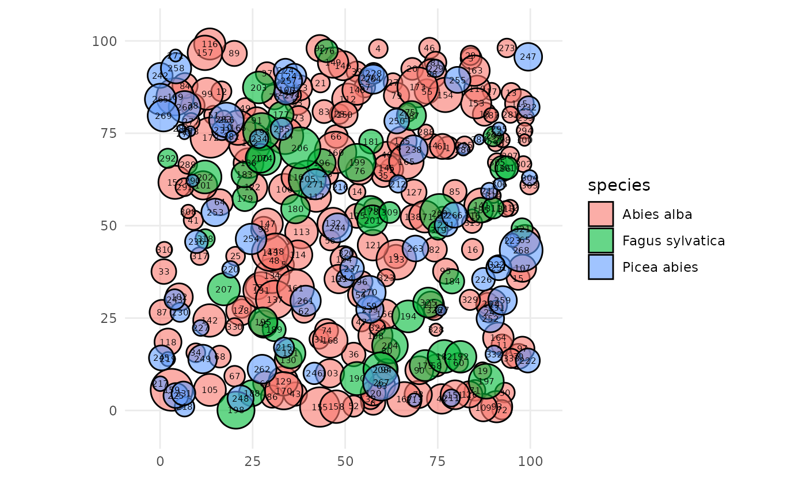
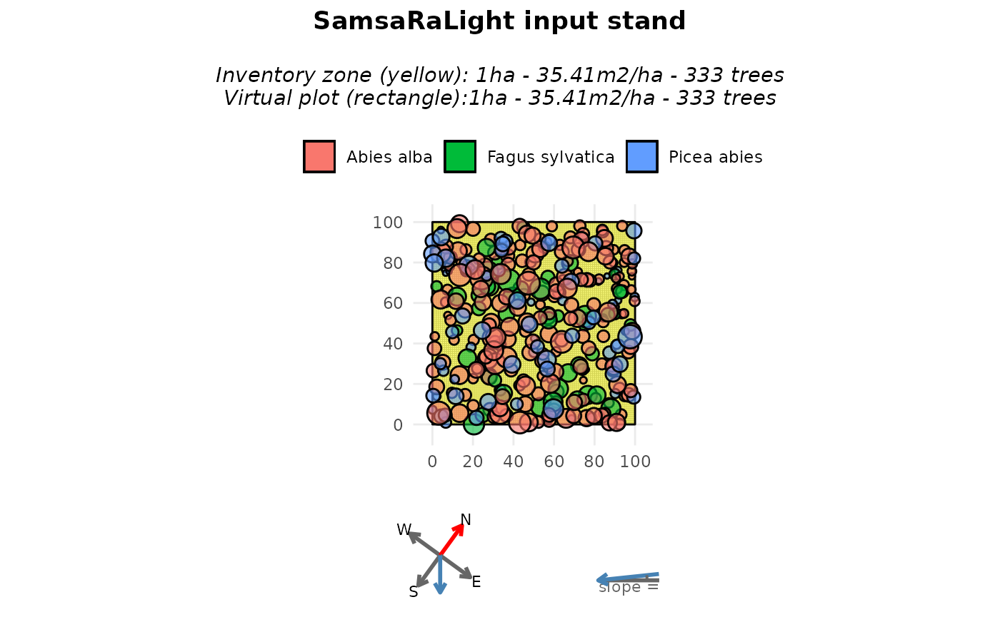
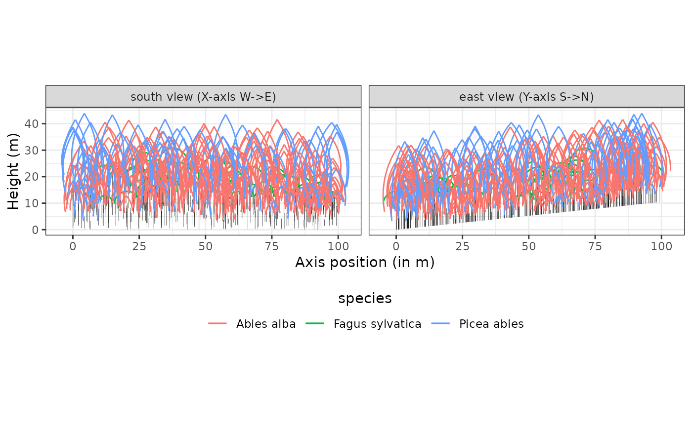
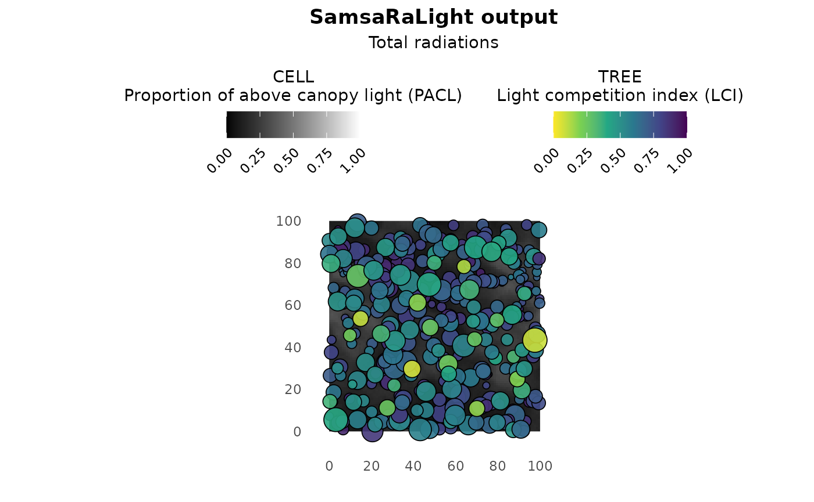
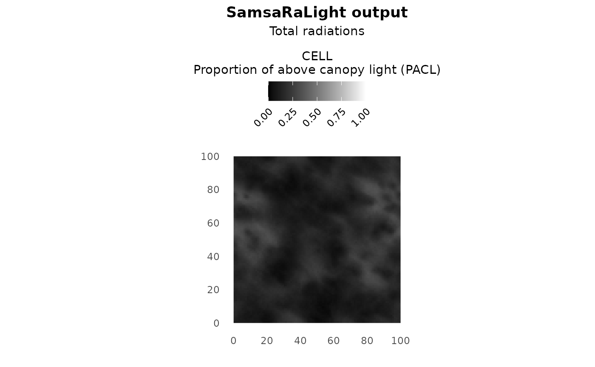
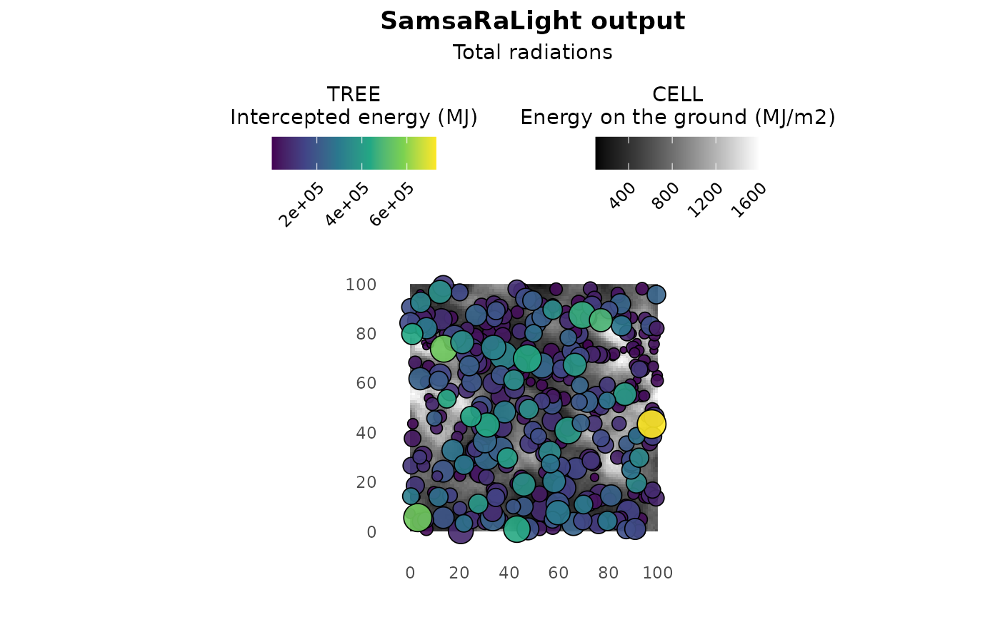

# 1 - A first minimal case

``` r
knitr::opts_chunk$set(
  collapse = TRUE,
  comment = "#>"
)
```

This is the first tutorial, showing you how to solve a basic problem
using the SamsaRaLight package. We will demonstrate this with the
Prenovel dataset, which is stored in the package as
[`SamsaRaLight::data_prenovel`](https://natheob.github.io/SamsaRaLight/reference/data_prenovel.md).
This dataset represents an uneven-aged stand of fir, spruce and beech
located in the Jura mountains in France. You can find more information
in the data documentation. We used this dataset as a minimal example
this comes from a “marteloscope” exercise, that is a plot used for
harvesting exercises on the field. The trees are inventoried inside a
formalised 1-ha squared plot (100m\*100m), thus being the easier
inventory for using the SamsaRaLight package. In the next tutorials, we
explain the case where trees are not inventoried in a formalized
rectangle plot (4 - Create a virtual stand from more complex tree
inventory).

``` r
library(SamsaRaLight)
library(dplyr)
```

## Input data

### Format the tree inventory

The user needs to define the individual trees composing the stand with
their crown dimensions. The data frame must be created with a specific
format and variables. See documentation using
`?SamsaRaLight::check_inventory()` to understand the format of the trees
dataset, and validate it using the same function.

The dataframe must contain mandatory information about the trees: a
unique integer id (`id_tree`), the species name (`species`), coordinates
in meters (`x`, `y`) and diameter at breast height in cm (`dbh_cm`). The
x and y coordinates must be given in meters on a flat plane (not
considering slope), and the z coordinate will be computed automatically
during the process from stand geometry. Be careful, you cannot use
longitude/latitude (WGS84 coordinates system), as it is angular
coordinates, thus not representing correctly relative distance between
each tree. Consider converting the coordinates in a planar reference
system such as local UTM. See the Tutorial 4 for an example on how to
use SamsaRaLight from trees inventoried with GPS data giving long/lat
coordinates (4 - Create a virtual stand from more complex tree
inventory).

In this tutorial, we represent the tree crowns with simple shapes,
defined in the `crown_type` column by a specific code: “E” (for an
ellipsoid) or “P” (for a paraboloid). The ellipsoidal shape “E” is
commonly used for broadleaved species, whereas a paraboloidal shape “P”
is commonly used for conifers. When using simple crown shapes, the user
must provide only 3 values to define the crown dimensions: the height of
the tree (`h_m` in meters), the height of the base of the crown
(`hbase_m` in meters) and the crown maximum radius that is the same is
the four cardinal directions as we consider simple symmetric crowns
(`rn_m`, `re_m`, `rs_m` and `rw_m`, all in meters). When considering
those type of simple crown shapes (“E” or “P”), the user must not
provide the `hmax_m` variable, which is the height at which the crown
radius is maximum. Indeed, it is automatically computed during the
process, being set to the crown base height ($hmax = hbase$) when
considering a paraboloidal shape “P”, and set at the middle of the crown
for an ellipsoidal shape “E” ($hmax = h - 0.5*(h - hbase)$).

``` r
input_trees_inv <- SamsaRaLight::data_prenovel$trees
head(input_trees_inv)
#>   id_tree    species       x       y  dbh_cm crown_type     h_m hbase_m hmax_m
#> 1       1 Abies alba 77.7336 71.0808 22.9320          P 14.8120  3.3073     NA
#> 2       2 Abies alba 62.5783 65.1864 18.2397          P 12.9612  4.7429     NA
#> 3       3 Abies alba 84.0060 95.2483 22.8472          P 15.8187  4.9055     NA
#> 4       4 Abies alba 58.9521 97.9011 19.1539          P 11.7033  4.2050     NA
#> 5       5 Abies alba 33.3423 39.4053 19.8852          P 14.6597  3.8346     NA
#> 6       6 Abies alba 57.5743  2.0656 20.1293          P 16.6530  7.6860     NA
#>     rn_m   re_m   rs_m   rw_m crown_openness crown_lad
#> 1 3.0204 3.0204 3.0204 3.0204            0.2     0.767
#> 2 3.0896 3.0896 3.0896 3.0896            0.2     0.767
#> 3 2.8350 2.8350 2.8350 2.8350            0.2     0.767
#> 4 2.5196 2.5196 2.5196 2.5196            0.2     0.767
#> 5 2.8208 2.8208 2.8208 2.8208            0.2     0.767
#> 6 3.2436 3.2436 3.2436 3.2436            0.2     0.767

# Check the format of the inventory table
SamsaRaLight::check_inventory(input_trees_inv)
#> Inventory table successfully validated.
```

The user can observe its validated inventory using the function
[`SamsaRaLight::plot_inventory()`](https://natheob.github.io/SamsaRaLight/reference/plot_inventory.md).
Computation time can be long as the trees are plotted in order of tree
height to well represent the vertical structure of the stand.

``` r
plot_inventory(input_trees_inv)
```



In the next tutorials, we will explain more in details the columns
`crown_openness`/`crown_lad` (3 - Choose the transmission model) and
consider more complex, asymmetric crown shapes (5 - Represent the crowns
with more complex shapes).

### Create the SamsaRaLight input stand

The SamsaraLight ray-tracing model needs to be run on a axis-aligned
rectangle stand that is split into square cells, with a given
homogeneous slope, orientation and aspect. Moreover, the user needs to
precise the plot latitude (Y-axis in WGS84 in degrees) as the model
considers that light rays’ geometry vary with plot latitude, discussed
further in the Tutorial 2 (2 - Understand ray-tracing).

The package provides a function that creates a standardized SamsaRaLight
virtual stand as a `sl_stand` R S3 object:
[`SamsaRaLight::create_sl_stand()`](https://natheob.github.io/SamsaRaLight/reference/create_sl_stand.md).
This function needs 5 mandatory arguments: the tree inventory table
(`tree_inv`, formatted as described above), the size of the square cell
that split the rectangle SamsaRaLight stand (`cell_size` in meters), the
plot latitude (`latitude`) and three variables defining the plane stand
geometry (`slope`, `aspect` and `north2x`, all in degrees). The function
checks internally that all arguments are correct and well formatted (set
the argument `verbose = FALSE` to avoid success messages).

Optionally but essential here to well define your virtual stand from the
tree inventory, the user can define the inventory zone with the argument
`core_polygon_df`. The polygon is defined by a data.frame that contains
the relative coordinates `x` and `y` of the vertices of the zone where
the trees have been inventoried.

The `cell_size` argument defines the precision of the SamsaRaLight
ray-tracing model. The ray-tracing model will casts rays towards the
center of each cell and estimate the light arriving to this cell after
attenuation by tree crowns and the smaller the cells are defined, the
more rays the model casts per m2. The default `cell_size` is 10, leading
to very fast computation time. The user can go towards the maximum
precision which is 1 (1m\*1m square cells) to produce high-resolution
shading maps (see the end of this tutorial), but will lead to much
heavier computation time and memory use. Indeed, computation time is not
proportional to `cell_size` but rather quadratic: the number of cells in
the plot increases quadratically with the cell size, and also
consequently is the total number of cast rays during the simulation
(which is the main factor for computation time and memory use).

The `north2x` argument is the angle from North to X-axis (clockwise),
thus defining the rotation of real North (tree inventory) relative to
the virtual plot X-axis (SamsaRaLight stand). The default 90°
corresponds to a Y-axis oriented toward true North (0°: x-axis points
North, 90° : x-axis points East, 180° : x-axis points South, 270° :
x-axis points West). The `slope` and `aspect` arguments define the
geometry in case of a non-plane stand, with the aspect variable
representing the direction the slope faces downhill, defined by the
angle of the steepest downslope direction measured clockwise from true
North (0°: North-facing slope, East-facing slope: 90°, 180°:
South-facing slope, 270°: West-facing slope). The Tutorial 2 (2 -
Understand ray-tracing) also shows how the light on the ground varies
with stand geometry.

``` r
input_sl_stand <- SamsaRaLight::create_sl_stand(
  
  # Tree inventory formatted table
  trees_inv = input_trees_inv,
  
  # Precision of the SamsaRaLight model
  cell_size = 1,
  
  # Stand information
  latitude = SamsaRaLight::data_prenovel$info$latitude,
  slope = SamsaRaLight::data_prenovel$info$slope,
  aspect = SamsaRaLight::data_prenovel$info$aspect,
  north2x = SamsaRaLight::data_prenovel$info$north2x,
  
  # Definition of the inventory zone definition
  core_polygon_df = SamsaRaLight::data_prenovel$core_polygon
)
#> Polygon successfully validated.
#> SamsaRaLight stand successfully created.
```

The user can observe the creating SamsaRaLight virtual stand object
(`sl_stand` S3 object) using the base functions
[`print()`](https://rdrr.io/r/base/print.html),
[`summary()`](https://rdrr.io/r/base/summary.html) and
[`plot()`](https://rdrr.io/r/graphics/plot.default.html). The
[`plot()`](https://rdrr.io/r/graphics/plot.default.html) function allows
to observe the stand in two views: a stand map with circles representing
the located maximum crown radius of trees from above, or a top-down plot
mainly showing heights of crowns and trunks from a South-view (facing
North) and a East-view (facing West).

``` r
print(input_sl_stand)
#> SamsaRaLight stand of 1 ha with 333 trees and 0 sensors (100 x 100 cells, 1 m)
```

``` r
summary(input_sl_stand)
#> 
#> SamsaRaLight stand summary
#> ================================
#> 
#> 
#> Inventory (core polygon):
#>   Area              : 1.00 ha
#>   Trees             : 333
#>   Density           : 333.0 trees/ha
#>   Basal area        : 35.41 m2/ha
#>   Quadratic mean DBH: 36.8 cm
#> 
#> Simulation stand (core + filled buffer):
#>   Area              : 1.00 ha
#>   Trees             : 333
#>   Density           : 333.0 trees/ha
#>   Basal area        : 35.41 m2/ha
#>   Quadratic mean DBH: 36.8 cm
#> 
#> Stand geometry:
#>   Grid              : 100 x 100 (10000 cells)
#>   Cell size         : 1.00 m
#>   Slope             : 6.00 deg
#>   Aspect            : 144.00 deg
#>   North to X-axis   : 54.00 deg
#> 
#> Number of sensors: 0
#> 
#> Available light interception models:
#>   - Turbid medium (crown_lad)
#>   - Porous envelope (crown_openness)
```

``` r
plot(input_sl_stand)
```



``` r
plot(input_sl_stand, top_down = TRUE)
```



In the next tutorials, we explain how to create a virtual stand where
trees are not inventoried directly in an axis-aligned rectangle plot
(4 - Create a virtual stand from more complex tree inventory).

### Monthly radiations

The user needs to define in a data frame the monthly energy specific to
its plot location. For each month (represented by an integer number
between 1 and 12), one needs to inform $Hrad$ as the global monthly
energies (in $MJ.m^{- 2}$), and $DGratio$ as the ratio of diffuse energy
relative to global energy (needed to represent the proportion of diffuse
and direct energy). The discretization of diffuse and direct rays from
the given radiation dataset is discussed in the next tutorial (2 -
Understand ray-tracing).

This data frame can be automatically constructed using the SamsaRaLight
function
[`SamsaRaLight::get_monthly_radiations()`](https://natheob.github.io/SamsaRaLight/reference/get_monthly_radiations.md),
given the latitude and longitude of the plot. It gets radiation data
from the PVGIS European database but needs an Internet connection.
Otherwise, the monthly radiation data frame used in this tutorial
(Prenovel stand) is stored within the package and can be retrieved using
`SamsaRaLight::data_prenovel$radiations`.

``` r
# Get the monthly radiation data frame
input_monthly_radiations <- SamsaRaLight::get_monthly_radiations(
  SamsaRaLight::data_prenovel$info$latitude, 
  SamsaRaLight::data_prenovel$info$longitude
)

input_monthly_radiations
#>    month     Hrad  DGratio
#> 1      1 137.0902 0.580625
#> 2      2 206.3025 0.506875
#> 3      3 353.8260 0.493125
#> 4      4 465.8220 0.490000
#> 5      5 535.2458 0.508750
#> 6      6 618.1785 0.463750
#> 7      7 655.1730 0.425000
#> 8      8 557.6332 0.436250
#> 9      9 423.9382 0.446875
#> 10    10 280.2780 0.475000
#> 11    11 157.9635 0.538750
#> 12    12 116.4960 0.587500

# Check that it the format is correct
check_monthly_radiations(input_monthly_radiations)
#> Radiation table successfully validated.
```

## Run SamsaRaLight

From now, you can easily run the SamsaraLight ray-tracing model using
the function
[`run_sl()`](https://natheob.github.io/SamsaRaLight/reference/run_sl.md)
from the only two mandatory arguments: the created SamsaRaLight virtual
stand object `sl_stand` and the monthly radiations table
`monthly_radiations`.

The `use_torus` argument is essential to account for the lack of
information about trees surrounding the inventory zone. When set to TRUE
(default), the stand is treated as an infinite plot, where the
inventoried trees are surrounded by identical copies of the stand. When
set to FALSE, the stand is assumed to be bordered by grasslands without
trees, which may bias light interception estimates, particularly near
the edges of the virtual stand. Thus, set the `use_torus` argument to
FALSE only if it is biologically consistent, such as a stand in the
middle of a clear-cut or surrounded by fields and roads.

The package SamsaRaLight allows for running the simulation in parallel
setting the argument `parallel_mode = TRUE`. When activating the
parallel_mode, the simulation will take by default all the internal
threads that are avaikable, but the user can decide how many cores to
dedicate to the simulation with the argument `n_threads`. During the
simulation, a message will appear to specify to the user how many cores
are used by the simulation, and how many are available with the device,
but the user can silence those messages with `verbose = TRUE` argument.
The parallelisation is done internally across independent cells, while
running sequentially each ray for a given cell. By doing so, the
parallel mode is even essential when the number of cells is large.
Parallelisation is done using OpenMP, but on platforms or compilers that
do not support OpenMP, parallelisation is disabled and computations run
in sequential mode (i.e. `parallel_mode = FALSE`).

``` r
sl_output <- SamsaRaLight::run_sl(
    
    # Mandatory arguments
    sl_stand = input_sl_stand,
    monthly_radiations = input_monthly_radiations,
    
    # Surrounding environment
    use_torus = TRUE,
    
    # Parallelisation arguments
    parallel_mode = TRUE,
    n_threads = NULL
  )
#> Warning in sl_set_openmp(parallel_mode, as.integer(n_threads)): OpenMP not
#> available: running sequentially.
#> parallel mode disabled because OpenMP was not available
#> SamsaRaLight simulation was run successfully.
```

For advanced users, an internal function is available using
`SamsaRaLight:::run_sl_advanced()` allowing to control deeper
ray-tracing parameters. The user-friendly function
[`SamsaRaLight::run_sl()`](https://natheob.github.io/SamsaRaLight/reference/run_sl.md)
internally wrap the advenced version with default parameters. In the
tutorials, we will not adress this advanced function, but all parameters
with default values can be find following the documentation of this
function. Otherwise, feel free to contact the main authors for a deeper
use of the package and the model.

## Simulation output

The output is a complex S3 R object, with first a list of two elements:
`$input` (that gathers inputs of the model defined above
`$input$sl_stand` and `$input$monthly_radiations`, associated to the
parameters of the simulation `$input$params`) and `$output` that
essentially contains output light variables at the tree-level
`output$light$trees` and at the cell-level `output$light$cells`. You can
also observe `output$light$sensors` that are the light output at a
located virtual light sensor, but this is discussed in the Tutorial 6
(6 - Add virtual sensors on the ground). Optionnaly, the user can set
the
[`run_sl()`](https://natheob.github.io/SamsaRaLight/reference/run_sl.md)
function argument `detailed_output` to TRUE in order to have more
information about the rays discretisation and interceptions, but it is
also discussed further in the next tutorial (2 - Understand
ray-tracing). In this tutorial, we will focus here on both the tree- and
cell-level output light variables, stored in `output$light`.

The object `$output$cells` contains output light variables for each
cell, identified by its unique id (`id_cell`, linked to the input cell
dataframe `sl_output$input$sl_stand$cells` to retrive cell center
coordinates). There are 3 output variables, which are `e` (for the
energy arriving on the cell in MJ/m2), `pacl` (for proportion of above
light canopy, which is the ratio between the energy arriving on the cell
and the energy before interception by the trees) and `punobs` (for the
proportion of energy on the cell that comes from unobstructed rays,
i.e. rays that have not been intercepted by any trees).

``` r
str(sl_output$output$light$cells)
#> 'data.frame':    10000 obs. of  4 variables:
#>  $ id_cell: int  1 2 3 4 5 6 7 8 9 10 ...
#>  $ e      : num  478 532 522 505 488 ...
#>  $ pacl   : num  0.105 0.117 0.115 0.111 0.107 ...
#>  $ punobs : num  0.308 0.377 0.473 0.406 0.329 ...
```

The object `$output$trees` contains output light variables for each
trees, identified by its unique id (`id_tree`). There are 4 output
variables, which are `e` (for the total energy intercepted by the tree
in MJ), `epot` (for the potential energy intercepted by the tree without
considering its neighbors in MJ, i.e. the total energy intercepted if
the tree was alone with the same crown dimensions), $lci = 1 - e/epot$
(which is a light competition index and a good proxy for tree dynamics,
see Beauchamp et al. 2025, representing the real intercepted energy
compared to the potential energy it could intercept without competition)
and `punobs` (for the proportion of energy intercepted by the tree that
comes from unobstructed rays, i.e. rays that have not been intercepted
by any other trees).

``` r
str(sl_output$output$light$trees)
#> 'data.frame':    333 obs. of  5 variables:
#>  $ id_tree: int  116 92 46 273 176 4 272 157 89 29 ...
#>  $ epot   : num  387315 253854 203071 76454 221087 ...
#>  $ e      : num  115800 96237 56293 15399 9713 ...
#>  $ lci    : num  0.701 0.621 0.723 0.799 0.956 ...
#>  $ eunobs : num  83985 81000 45459 10109 1318 ...
```

The user can observe the output of the SamsaRaLight simulation object
(`sl_output` S3 object) using the base functions
[`print()`](https://rdrr.io/r/base/print.html),
[`summary()`](https://rdrr.io/r/base/summary.html) and
[`plot()`](https://rdrr.io/r/graphics/plot.default.html). The
[`plot()`](https://rdrr.io/r/graphics/plot.default.html) function allows
to observe the stand map with tree- and cell-level colouring depending
on the output light variables. By default, the plot shows the light
competition index LCI for trees and the relative light on the ground
PACL for cells, as there are good proxies for estimating tree and stand
dynamics. In addition, the argument `show_trees` can be set to FALSE to
plot only a shade map as a nice plot for representing the understorey
light. Light variables to plot can be defined independently for both
trees and cells by setting `what_trees` and `what_cells` arguments. For
example, setting `what_trees = "intercepted"` and
`what_cells = "absolute` allows to better catch the differences in light
energies between trees and cells. However, be careful about the colours
of the cells, white areas do no mean cells in high-light but brighter
cells relatively to the others, it could be confusing without precise
legend…

``` r
print(sl_output)
#> SamsaRaLight output with 10000 cells, 333 trees and 0 sensors (no detailed output)
```

``` r
summary(sl_output)
#> 
#> SamsaRaLight simulation summary
#> ================================
#> 
#> Trees (crown interception)
#> ---------------------------
#>       epot               e                 lci         
#>  Min.   :   6930   Min.   :   861.8   Min.   :0.06625  
#>  1st Qu.: 153986   1st Qu.: 23681.0   1st Qu.:0.56729  
#>  Median : 282894   Median : 67855.4   Median :0.71628  
#>  Mean   : 311514   Mean   :116322.6   Mean   :0.68980  
#>  3rd Qu.: 444481   3rd Qu.:178181.5   3rd Qu.:0.84023  
#>  Max.   :1003557   Max.   :728911.8   Max.   :0.98942  
#> 
#> Cells (ground light)
#> -------------------
#>        e               pacl             punobs      
#>  Min.   :  98.2   Min.   :0.02165   Min.   :0.0000  
#>  1st Qu.: 442.3   1st Qu.:0.09752   1st Qu.:0.3358  
#>  Median : 635.1   Median :0.14004   Median :0.5030  
#>  Mean   : 677.0   Mean   :0.14928   Mean   :0.4834  
#>  3rd Qu.: 860.0   3rd Qu.:0.18963   3rd Qu.:0.6461  
#>  Max.   :1601.7   Max.   :0.35317   Max.   :0.9128  
#> 
#> Sensors
#> -------
#> No sensor energy variables available
```

``` r
plot(sl_output)
```



``` r
plot(sl_output, show_trees = F)
```



``` r
plot(sl_output, what_trees = "intercepted", what_cells = "absolute")
```


