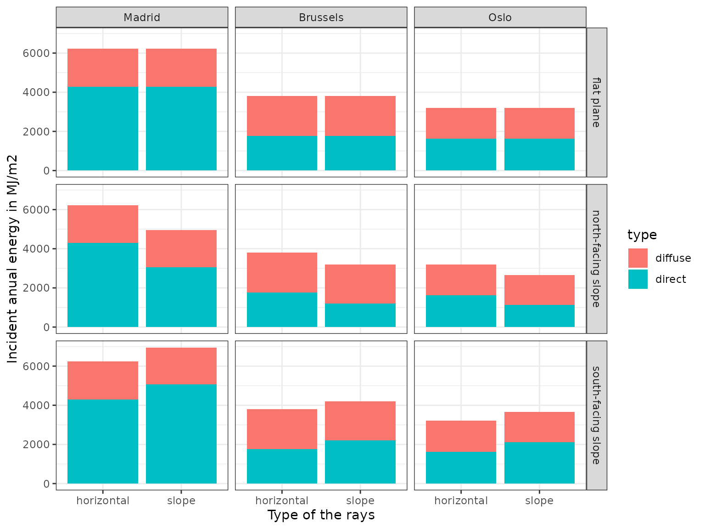
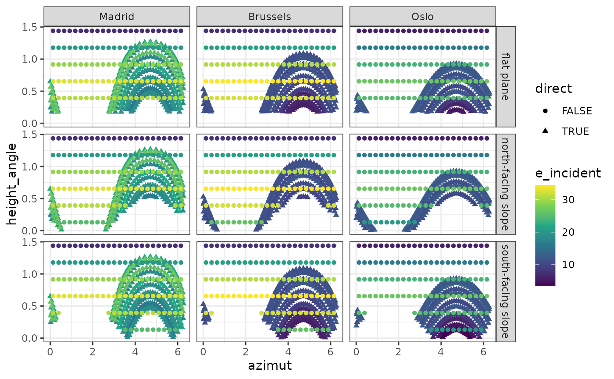
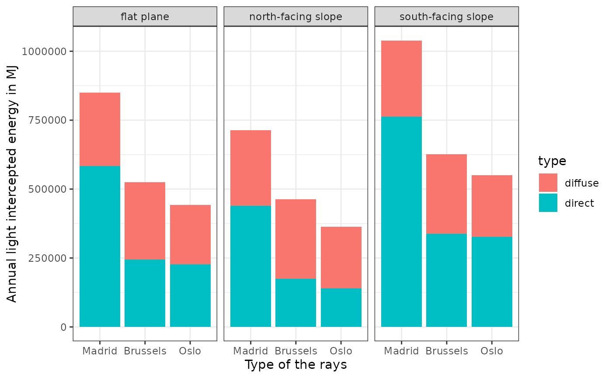
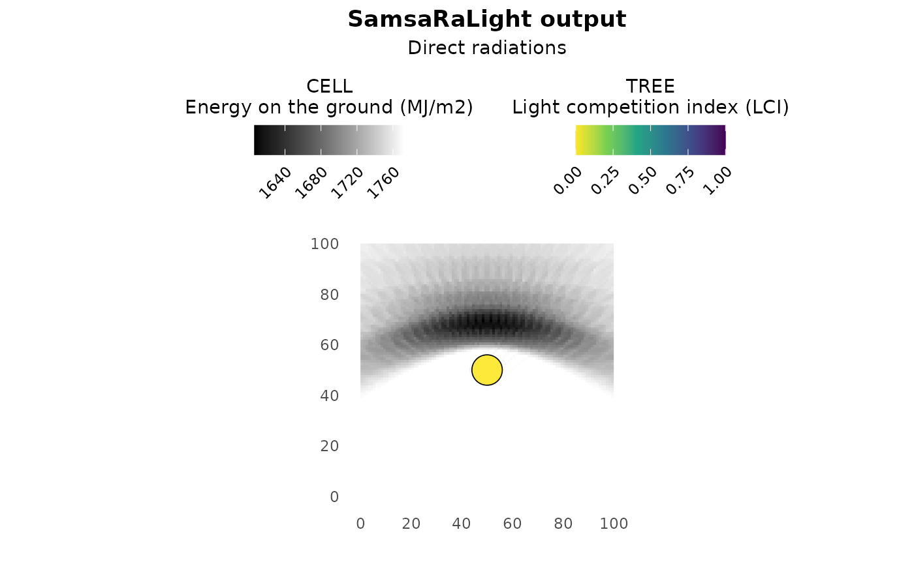
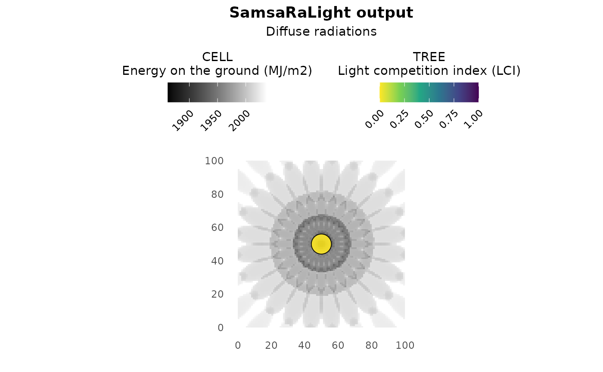
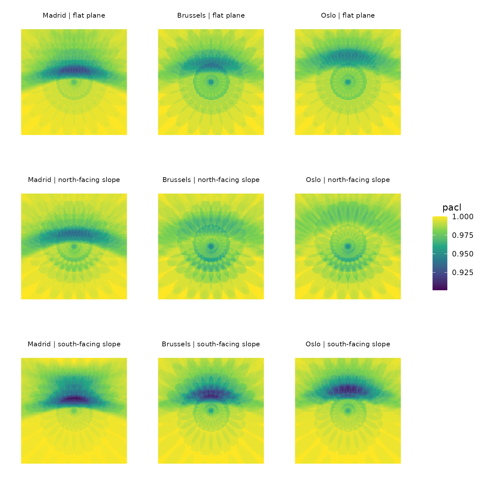

# 2 - Understand ray discretization with detailed output

In this tutorial, we will go deeper into the SamsaraLight model to
better understand ray-tracing, from discretisation of direct and diffuse
rays to the effect of stand geometry and latitude on light distribution
on the ground. To do so, we will create from scratch a virtual stand
with a single large tree at the center to observe its shading effect and
how it varies between three different cities in Europe (Madrid, Brussels
and Oslo) and three different stand geometry (a flat plane, a South- or
a North-facing slope).

``` r
library(SamsaRaLight)
library(dplyr)
library(purrr)
library(ggplot2)
library(cowplot)
```

## Prepare the experiment

### Create the tree inventory

We can take an example dataset to observe which variable we need to
create the tree inventory:

``` r
names(SamsaRaLight::data_prenovel$trees)
#>  [1] "id_tree"        "species"        "x"              "y"             
#>  [5] "dbh_cm"         "crown_type"     "h_m"            "hbase_m"       
#>  [9] "hmax_m"         "rn_m"           "re_m"           "rs_m"          
#> [13] "rw_m"           "crown_openness" "crown_lad"
```

Initialise the stand size, say 100x100m 1ha square plot:

``` r
stand_size_x <- 100
stand_size_y <- 100
```

Thus, create the tree inventory with one single large tree at the center
of the plot:

``` r
trees_inv <- data.frame(
  id_tree = 1,
  species = "not specified",
  x = stand_size_x / 2,
  y = stand_size_y / 2,
  dbh_cm = 100,
  crown_type = "E", # Symmetric ellipsoidal crown
  h_m = 40,
  hbase_m = 20,
  rn_m = 6,
  re_m = 6,
  rs_m = 6,
  rw_m = 6,
  crown_lad = 0.5 # Base LAD value, see Tutorial 3 and Tutorial 6 for deeper explanations
)

trees_inv
#>   id_tree       species  x  y dbh_cm crown_type h_m hbase_m rn_m re_m rs_m rw_m
#> 1       1 not specified 50 50    100          E  40      20    6    6    6    6
#>   crown_lad
#> 1       0.5
```

### Define the experimental design

Here, we define the experimental design, that is the
latitude/slope/aspect combinations we want to test. We will study 9
modalities as a combination of 3 latitudes representative of three
cities in Europe (Madrid, Brussels and Oslo) and 3 stand geometry with
different slope and aspect (a flat plane, a 20° north-facing slope and a
20° south-facing slope).

``` r
exp_design <- expand.grid(
  city = c("Madrid", "Brussels", "Oslo"), # Define three towns with different latitudes in Europe
  slope = c(0, 20),
  aspect = c(0, 180)
) %>% 
  
  # Set the longitude/latitude of our three towns
  dplyr::mutate(
    latitude = case_match(city,
                          "Madrid" ~ 40.4167,
                          "Brussels" ~ 50.8477,
                          "Oslo" ~ 59.9122),
    longitude = case_match(city,
                          "Madrid" ~ -3.7033,
                          "Brussels" ~ 4.3572,
                          "Oslo" ~ 10.7313)
  ) %>% 
  dplyr::filter(!(slope == 0 & aspect != 0)) %>% # Because aspect do not change anything in a flat plane
  dplyr::mutate(stand_geom = case_when(
                  slope == 0 ~ "flat plane",
                  slope > 0 & aspect == 0 ~ "north-facing slope",
                  slope > 0 & aspect == 180 ~ "south-facing slope"),
                id_simu = as.character(row_number())) %>% 
  dplyr::relocate(id_simu)

exp_design
#>   id_simu     city slope aspect latitude longitude         stand_geom
#> 1       1   Madrid     0      0  40.4167   -3.7033         flat plane
#> 2       2 Brussels     0      0  50.8477    4.3572         flat plane
#> 3       3     Oslo     0      0  59.9122   10.7313         flat plane
#> 4       4   Madrid    20      0  40.4167   -3.7033 north-facing slope
#> 5       5 Brussels    20      0  50.8477    4.3572 north-facing slope
#> 6       6     Oslo    20      0  59.9122   10.7313 north-facing slope
#> 7       7   Madrid    20    180  40.4167   -3.7033 south-facing slope
#> 8       8 Brussels    20    180  50.8477    4.3572 south-facing slope
#> 9       9     Oslo    20    180  59.9122   10.7313 south-facing slope
```

### Create monthly radiations tables

For each unique city (Madrid, Brussels and Oslo), create the monthly
radiation tables containing for each of the 12 months information about
global energy quantity () and the ratio of this energy between diffuse
and direct energies (DGratio), in MJ/m2. It is important to note that
the monthly values here correspond to radiations received on a
horizontal plane and are subsequently corrected by the model to estimate
incident radiation on sloped surfaces.

``` r
# Get each unique city coordinate
coords <- exp_design %>% 
  dplyr::distinct(city, longitude, latitude)

# Create the list of radiation tables
data_rad_list <- vector("list", length = nrow(coords))
names(data_rad_list) <- coords$city

# Fetch 
for (i in seq_along(coords)) {
  
  data_rad_list[[coords$city[i]]] <- SamsaRaLight::get_monthly_radiations(
    latitude = coords$latitude[i], 
    longitude = coords$longitude[i]
  )
  
  check_monthly_radiations(data_rad_list[[coords$city[i]]])
}
#> Radiation table successfully validated.
#> Radiation table successfully validated.
#> Radiation table successfully validated.
```

``` r
# Create the plot with monthly global energies
plt_hrad <- data_rad_list %>% 
  dplyr::bind_rows(.id = "city") %>%
  
  ggplot(aes(y = Hrad, x = month, color = city)) +
  geom_point() +
  geom_line() +
  labs(subtitle = "Global energy") +
  theme_bw() +
  theme(legend.position = "bottom",
        plot.subtitle = element_text(hjust = 0.5))

# Create the plot with monthly ratio between diffuse and direct rays
plt_dgratio <- data_rad_list %>% 
  dplyr::bind_rows(.id = "city") %>%
  
  ggplot(aes(y = DGratio, x = month, color = city)) +
  geom_point() +
  geom_line() +
  labs(subtitle = "Ratio diffuse/global") +
  theme_bw() +
  theme(legend.position = "none",
        plot.subtitle = element_text(hjust = 0.5))

# Get legend containing cities
legend_radiation <- cowplot::get_legend(plt_hrad)
plt_hrad <- plt_hrad + theme(legend.position = "none")

# Combines the plots
cowplot::plot_grid(
  legend_radiation,
  cowplot::plot_grid(plt_hrad, plt_dgratio, nrow = 1),
  ncol = 1, rel_heights = c(1, 10)
)
```


Across all cities, monthly global radiation peaks during spring and
summer due to longer daylight and higher solar elevation angles, which
reduce atmospheric scattering and favor direct radiation. In contrast,
winter months combine shorter days, lower sun angles, and increased
atmospheric path length, leading to lower global energy and a higher
diffuse fraction.

Madrid exhibits higher global radiation and a lower diffuse-to-global
ratio due to its lower latitude, which results in higher solar
elevations, shorter atmospheric path lengths, and therefore a dominance
of direct radiation throughout the year. However, the effect of latitude
tends to plateau: Brussels (50°N) and Oslo (60°N) exhibit similar
monthly radiation totals and diffuse/direct ratios. This results from a
compensation between lower solar elevation and longer day length: at
high latitudes, summer radiation is characterized by long-lasting
low-angle direct sunlight, which can dominate over diffuse radiation
when integrated over the month.

Although the total amount and partitioning of radiation are comparable
between Brussels and Oslo, the geometric distribution of direct rays
differs markedly as we will explore later in this tutorial, which has
strong implications for 3D light interception and shading patterns.

### Create the SamsaRaLight input stands

First, we have to define our tree inventory zone by defining a table
with each vertex of our polygon. In our case, it a square of 100x100m,
thus 4 vertices with combination of 0 and 100 as coordinates. Be
careful, we have to define the vertices in the correct order to have a
mathematically correct polygon, otherwise, the function will first try
to correct your polygon, and if it fails, it will send an error.

``` r
core_polygon_df <- data.frame(
  x = c(0, 100, 100, 0),
  y = c(0, 0, 100, 100)
)

core_polygon_df
#>     x   y
#> 1   0   0
#> 2 100   0
#> 3 100 100
#> 4   0 100
```

Then, we create the SamsaRaLight input stand from the created tree
inventory, for each of the different stand geometry and latitude in our
experimental design. We set the cell size as 1x1m in order to observe
with great precision the shading effect of the tree within the stand.

``` r
sl_stand_list <- vector("list", length = nrow(exp_design))

for (i in 1:nrow(exp_design)) {
  
  mod_design <- exp_design[i,]
 
  # Create the stand with given stand geometry, tree inventory and latitude
  sl_stand_list[[i]] <- SamsaRaLight::create_sl_stand(
    trees_inv = trees_inv,
    cell_size = 1,
    latitude = mod_design$latitude,
    slope = mod_design$slope,
    aspect = mod_design$aspect,
    north2x = 90, # i.e. Y-axis oriented to real North
    core_polygon_df = core_polygon_df
  )
}
#> Polygon successfully validated.
#> SamsaRaLight stand successfully created.
#> Polygon successfully validated.
#> SamsaRaLight stand successfully created.
#> Polygon successfully validated.
#> SamsaRaLight stand successfully created.
#> Polygon successfully validated.
#> SamsaRaLight stand successfully created.
#> Polygon successfully validated.
#> SamsaRaLight stand successfully created.
#> Polygon successfully validated.
#> SamsaRaLight stand successfully created.
#> Polygon successfully validated.
#> SamsaRaLight stand successfully created.
#> Polygon successfully validated.
#> SamsaRaLight stand successfully created.
#> Polygon successfully validated.
#> SamsaRaLight stand successfully created.
```

## Run SamsaRaLight

We can now easily run the SamsaraLight ray-tracing model on our 9
virtual stands. Here, we decided to not use the torus as we want to
observe the shading effect of only the single tree in the middle of the
plot, thus considering the virtual 100x100m is surrounded by grasslands.

``` r
# Store SamsaraLight outputs in a list
out_sl_list <- vector("list", length = nrow(exp_design))

for (i in 1:nrow(exp_design)) {
  
  mod_design <- exp_design[i,]
  
  # Run SamsaraLight
  out_sl_list[[i]] <- SamsaRaLight::run_sl(
    
    # Simulation inputs
    sl_stand = sl_stand_list[[i]],
    monthly_radiations = data_rad_list[[mod_design$city]],
    
    # Define stand boundaries
    use_torus = FALSE,
    
    # Set detailed output to have information about ray-discretization and direct/diffuse outputs
    detailed_output = TRUE,
    
    # Activate parallel mode
    parallel_mode = TRUE,
    verbose = FALSE
  ) 
}
#> Warning in sl_set_openmp(parallel_mode, as.integer(n_threads)): OpenMP not
#> available: running sequentially.
#> Warning in sl_set_openmp(parallel_mode, as.integer(n_threads)): OpenMP not
#> available: running sequentially.
#> Warning in sl_set_openmp(parallel_mode, as.integer(n_threads)): OpenMP not
#> available: running sequentially.
#> Warning in sl_set_openmp(parallel_mode, as.integer(n_threads)): OpenMP not
#> available: running sequentially.
#> Warning in sl_set_openmp(parallel_mode, as.integer(n_threads)): OpenMP not
#> available: running sequentially.
#> Warning in sl_set_openmp(parallel_mode, as.integer(n_threads)): OpenMP not
#> available: running sequentially.
#> Warning in sl_set_openmp(parallel_mode, as.integer(n_threads)): OpenMP not
#> available: running sequentially.
#> Warning in sl_set_openmp(parallel_mode, as.integer(n_threads)): OpenMP not
#> available: running sequentially.
#> Warning in sl_set_openmp(parallel_mode, as.integer(n_threads)): OpenMP not
#> available: running sequentially.
```

## Understand the detailed output

### The change in incident energy with stand latitude and stand geometry

The annual incident energy of diffuse and direct rays (in MJ/m2),
integrated over the year, is provided for both a horizontal surface and
the slope in `output$monthly_rays$energies`, returned by the
[`run_sl()`](https://natheob.github.io/SamsaRaLight/reference/run_sl.md)
function. These values represent the annual radiation above the canopy
and can be interpreted as the energy reaching the forest floor in the
absence of trees, either on a horizontal plane or on the slope. In the
ray-tracing model, incident energy on the slope is used to compute tree
light interception and energy received by ground cells, whereas energy
on a horizontal plane is used for radiation reaching virtual sensors
(see Tutorial 3: Understanding transmission models with virtual
sensors).

``` r
# Create a dataframe for comparing incident energies
out_sl_list %>% 
  purrr::map(~as.data.frame(as.list(.x$output$monthly_rays$energies))) %>% 
  dplyr::bind_rows(.id = "id_simu") %>% 
  dplyr::mutate(horizontal_total = horizontal_direct + horizontal_diffuse,
                slope_total = slope_direct + slope_diffuse) %>% 
  tidyr::pivot_longer(!id_simu, 
                      names_pattern = "(.*)_(.*)",
                      names_to = c("surface", "type"),
                      values_to = "energy") %>% 
  dplyr::left_join(exp_design, by = "id_simu") %>% 
  dplyr::filter(type != "total") %>% 
  
# Plot the graphic
  ggplot(aes(y = energy, x = surface, fill = type)) +
  
  geom_col() +
  facet_grid(cols = vars(city), rows = vars(stand_geom)) +
  theme_bw() +
  ylab("Incident energy in MJ/m2") +
  xlab("Type of the rays")
```



For each location, the received energy on a slope equals that on a
horizontal surface when the slope is flat, whereas a south-facing slope
receives more energy and a north-facing slope receives less. In the
Northern Hemisphere, the Sun follows a daily trajectory predominantly
oriented toward the south, so tilting a surface toward the south
increases its alignment with incoming direct radiation, while tilting it
toward the north reduces exposure.

As discussed above, differences between locations are also evident, with
Madrid receiving much greater incident energy than Brussels and Oslo,
mainly due to a higher contribution of direct radiation. Brussels in
turn shows slightly higher incident energy than Oslo, particularly for
diffuse radiation, as confirmed by the monthly incident energy ratio
from previous graphs.

### Understand the discretisation of direct and diffuse rays

The discretisation of the rays are given in the
`output$monthly_rays$rays` of the
[`run_sl()`](https://natheob.github.io/SamsaRaLight/reference/run_sl.md)
function output. Direct rays (`direct = TRUE`) follow the Sun’s annual
trajectory as determined by latitude, while diffuse rays
(`direct = FALSE`) are discretized over the entire sky hemisphere. Ray
directions are defined by azimut and elevation (`azimut` and
`height_angle`, in radians), and their incident energies (`e_incident`
in MJ/m2) are derived from monthly global radiation and
diffuse-to-global ratios and distributed according to ray geometry.
Parameters relative to the discretisation of diffuse and direct rays can
be seen and tweaked from the arguments of the advanced SamsaRaLight
function : `sl_run_advanced()`.

``` r
out_sl_list %>% 
  purrr::map(~as.data.frame(as.list(.x$output$monthly_rays$rays))) %>% 
  dplyr::bind_rows(.id = "id_simu") %>% 
  dplyr::left_join(exp_design, by = "id_simu") %>% 
  
  ggplot(aes(x = azimut, y = height_angle, 
             color = e_incident, shape = direct)) +
  geom_point() +
  facet_grid(cols = vars(city), rows = vars(stand_geom)) +
  scale_color_viridis_c() +
  theme_bw()
```



In the graph above, two distinct azimuth–elevation patterns can be
observed. Direct rays form a paraboloid-shaped distribution,
representing the Sun’s annual trajectory, whereas diffuse rays form a
regular grid of points corresponding to their discretization over the
entire sky hemisphere. The maximum elevation angle of direct rays
increases with decreasing latitude, reflecting a higher solar path over
the year and consistently higher individual ray energies for both direct
and diffuse components. Sloped surfaces allow low-elevation,
near-horizontal rays to reach the ground; however, for north-facing
slopes this results in a strong truncation toward higher azimuth angles,
primarily affecting many direct rays, while south-facing slopes exhibit
a weaker truncation toward lower azimuth angles, mainly affecting a
smaller fraction of diffuse rays.

### Consequences in tree light interception

If the user set `detailed_output = TRUE` in the
[`run_sl()`](https://natheob.github.io/SamsaRaLight/reference/run_sl.md)function,
the tree light output table `output$light$trees` also contains light
interception variables for both direct and diffuse radiations. In the
case of absolute energy variables (`e` and `epot`), the total energy is
the sum of both direct and diffuse intercepted energies. We can observe
how the annual energy intercepted by the tree varies with stand geometry
and latitude, for both direct and diffuse rays.

``` r
# Create a dataframe for comparing intercepted energies
out_sl_list %>% 
  purrr::map(~as.data.frame(as.list(.x$output$light$trees))) %>% 
  dplyr::bind_rows(.id = "id_simu") %>%
  dplyr::select(id_simu, id_tree, e_total = e, e_direct, e_diffuse) %>% 
  tidyr::pivot_longer(!c(id_simu, id_tree), 
                      names_prefix = "e_",
                      names_to = "type",
                      values_to = "energy_intercepted") %>% 
  dplyr::left_join(exp_design, by = "id_simu") %>% 
  dplyr::filter(type != "total") %>% 
  
  # Plot the graphic
  ggplot(aes(y = energy_intercepted, x = city, fill = type)) +
  
  geom_col() +
  facet_wrap(~stand_geom) +
  theme_bw() +
  ylab("Annual light intercepted energy in MJ") +
  xlab("Type of the rays")
```



As a direct consequence of ray discretization, which determines both ray
geometry and energy, the single tree intercepted more annual energy on a
south-facing slope than on a horizontal surface, and more than on a
north-facing slope. These differences arise primarily from the direct
radiations, as slope and aspect strongly influence the number and
orientation of direct beams reaching the canopy and the ground. In
addition, the single tree intercepted more energy in Madrid than in
Brussels and Oslo, which was amplified on south-facing slopes due to the
greater contribution of direct radiation at lower latitudes combined
with slope and aspect effects acting mainly on direct rays.

### Consequences on light distribution within the stand

If the user set `detailed_output = TRUE` in the
[`run_sl()`](https://natheob.github.io/SamsaRaLight/reference/run_sl.md)function,
the cell light output table `output$light$cells` also contains light
variables for both direct and diffuse radiations. The user can
[`plot()`](https://rdrr.io/r/graphics/plot.default.html) the output
light on the ground from total radiation (default behavior, argument
`energy_direct = NULL`), but also only from direct energy
(`direct_energy = TRUE`) or from diffuse radiations
(`direct_energy = FALSE`).

#### Patterns of direct and diffuse radiations

Here we observe the shading effect of the single tree for both direct
and diffuse radiations within an example plot (Brussels, flat plane) to
show the different patterns between direct/diffuse components. We plot
here the absolute amount of energy on the ground in MJ/m2 for each of
the 10.000 1x1m cell after attenuation by the tree located in the middle
of the plot. Be careful, the color for both direct and diffuse are not
on the same scale. Also, note that in the output of this experiment, the
tree light competition index LCI is equal to 0 (i.e. no light
competition) as the tree is alone in the stand: the total energy
intercepted $e$ is equal to the potential energy intercepted $epot$.

##### Direct radiations

``` r
plot(out_sl_list[[2]], what_cells = "absolute", 
     show_trees = TRUE, direct_energy = TRUE)
```



For the direct ray shading effect, we observe a paraboloidal-shaped
pattern oriented toward the North (i.e., with the `north2x` variable set
to 90° when creating the virtual stand, so that the Y-axis points to
true North). This pattern reflects the annual trajectory of the Sun.
Direct rays primarily strike the tree crown from the South, casting
shadows on the ground to the North of the tree. As we move further
toward the North, East, or West, the shading effect of the tree
decreases, with the strongest gradient along the Y-axis toward the
North, because the Sun moves daily from East to West thus slightly
compensating the tree shading effect over the course of the day.

##### Diffuse radiations

``` r
plot(out_sl_list[[2]], what_cells = "absolute", 
     show_trees = TRUE, direct_energy = FALSE)
```



For the diffuse rays, we observe a symmetric pattern around the
tree—quite a pretty flower-like shape! This symmetry reflects the
discretization of diffuse rays over the entire sky hemisphere. The
slightly non-continuous appearance of the pattern results from the
coarser discretization used for diffuse rays compared to direct rays.
This reduced precision is intentional, as increasing the number of
diffuse rays would quadratically increase computation time without
significantly improving accuracy.

#### Combined effect on the total relative energy on the ground

Comparing absolute ground energy values using a common color scale
across all modalities results in nearly uniform plots, because
variations in energy are much larger between latitudes and surface
geometries than within a single cell due to shading by an individual
tree. To highlight intra-cell variability, we therefore use the PACL
(relative) scale, which removes the dominant effects of stand geometry
and site location on ground energy. As a result, PACL provides a more
relevant proxy for assessing regeneration dynamics and visualizing shade
patterns, as it primarily reflects the shading effects of trees within
the stand rather than large-scale site effects.

``` r
# Get minimum PACL value 
pacl_range <- out_sl_list %>% 
  purrr::map(~.x$output$light$cells$pacl) %>% 
  unlist() %>% 
  range()

# Store plots in a list
plt_ground_list <- vector("list", nrow(exp_design))
legend <- NULL

for (i in 1:nrow(exp_design)) {
  
  mod_design <- exp_design[i,]
  
  # Plot the stand with light outputs
  tmp_sl_plot <- plot(out_sl_list[[i]], 
                      what_cells = "relative",
                      show_trees = FALSE)
  
  # Change some ggplot2 features
  tmp_sl_plot <- tmp_sl_plot +
    labs(title = NULL,
         subtitle = paste(mod_design$city, "|", mod_design$stand_geom)) +
    theme(legend.position = "top",
          axis.text = element_blank(),
          plot.subtitle = element_text(size = 8, hjust = 0.5)) +
    scale_fill_viridis_c(limits = pacl_range)
    
    
  # Fetch the legend if it is not already done
  # And remove the plot legend after that
  if (is.null(legend)) {
    tmp_sl_plot <- tmp_sl_plot + theme(legend.position = "right")
    legend <- cowplot::get_legend(tmp_sl_plot)
  }
  
  tmp_sl_plot <- tmp_sl_plot + theme(legend.position = "none")
    
  
  # Add the plot to the list
  plt_ground_list[[i]] <- tmp_sl_plot
}

# Gather all the plots using the cowplot package
cowplot::plot_grid(
  cowplot::plot_grid(plotlist = plt_ground_list,
                     nrow = 3, ncol = 3),
  legend,
  nrow = 1, rel_widths = c(5, 1)
)
```



The graph above combines the patterns observed from the ray
discretization, taking into account both stand geometry and latitude.
South-facing slopes show a stronger attenuation of direct rays
(reflected by lower PACL values in the paraboloidal-shaped pattern) at
the expense of diffuse rays, which exhibit higher PACL values in the
flower-like pattern. Latitude primarily affects the shading pattern of
direct rays: at lower latitudes, such as Madrid, shade is more
concentrated near the tree, whereas at higher latitudes, shading from
direct rays is more extended and PACL from diffuse rays is generally
lower, particularly on north-facing slopes.
