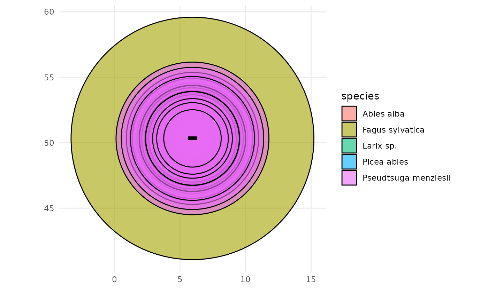
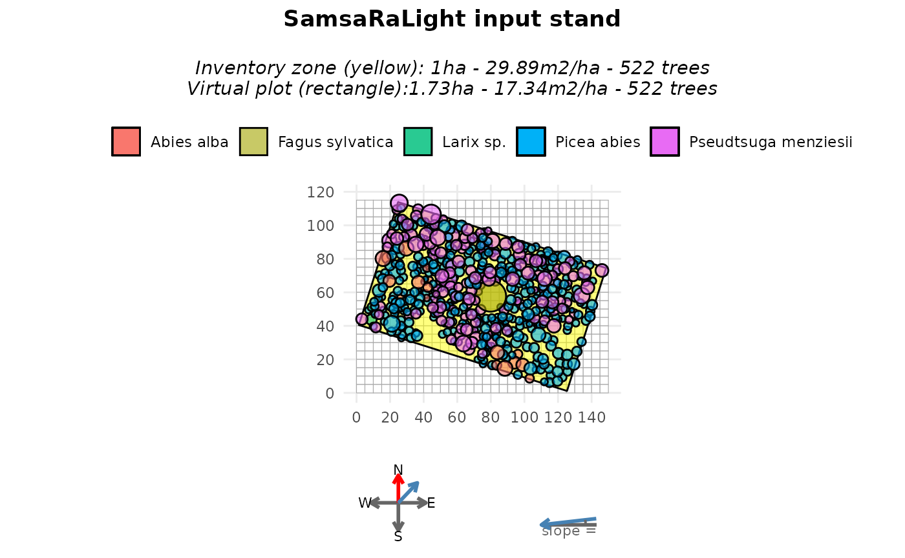
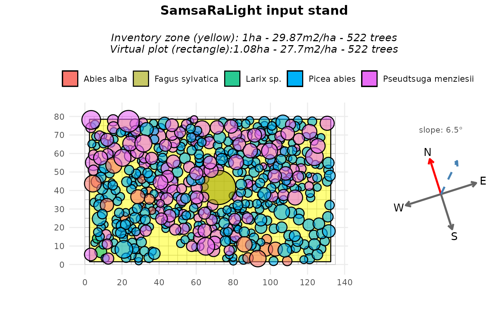
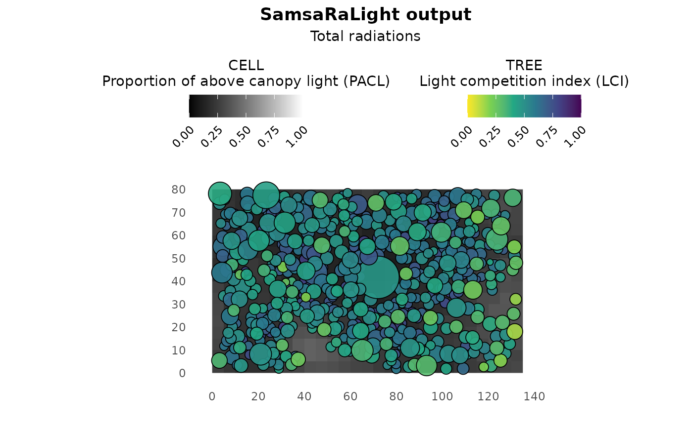
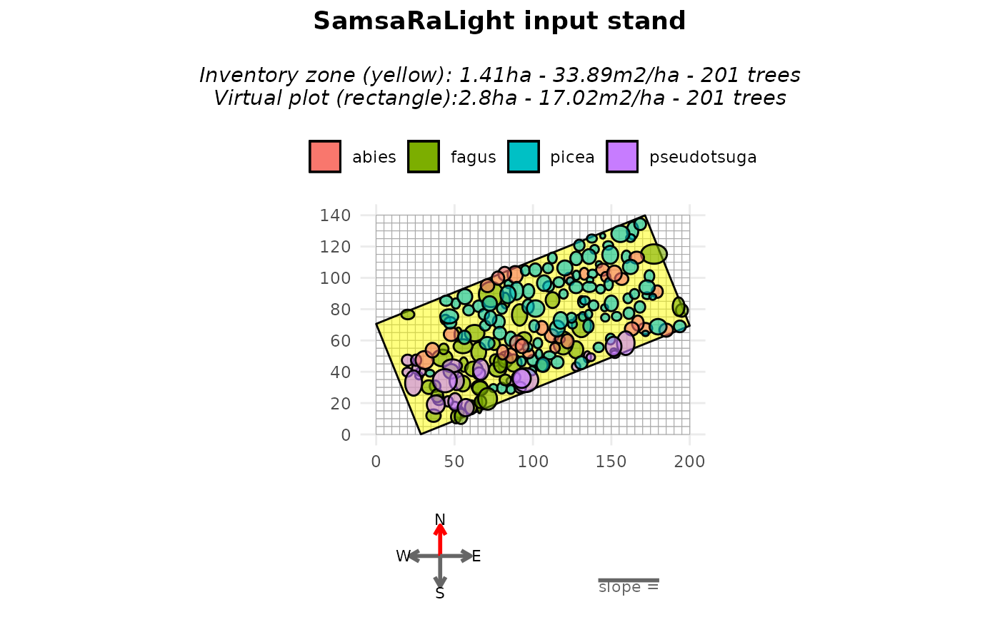
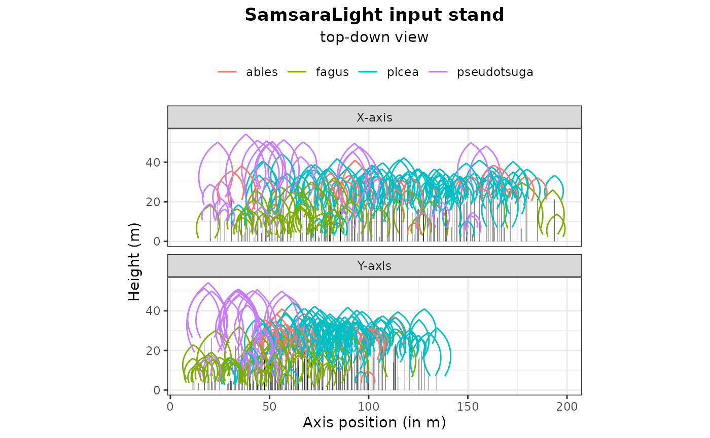
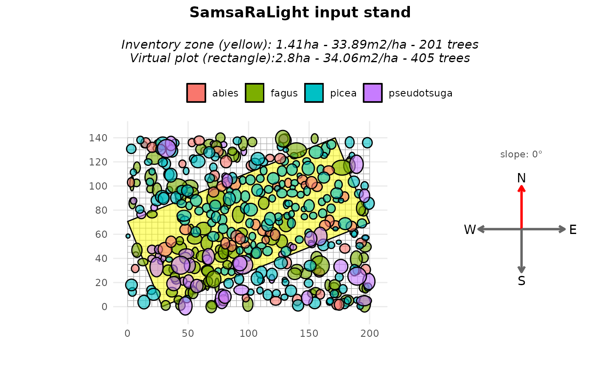
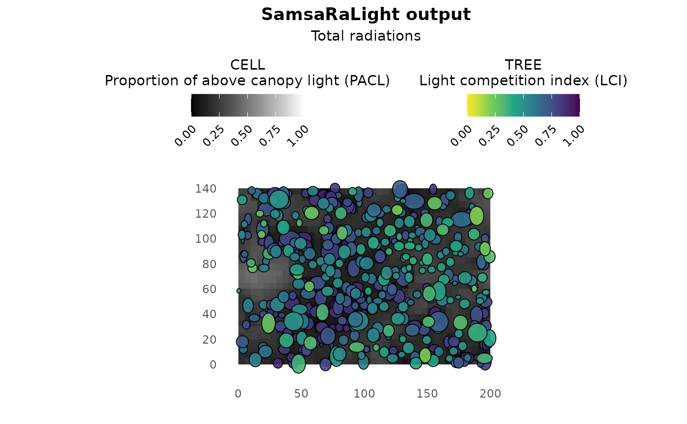
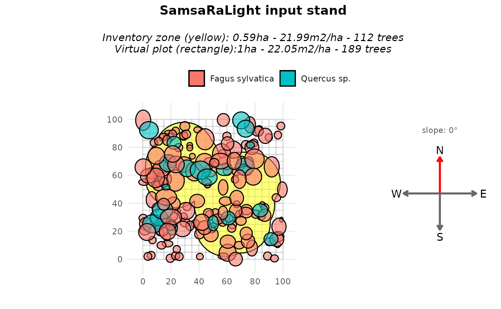
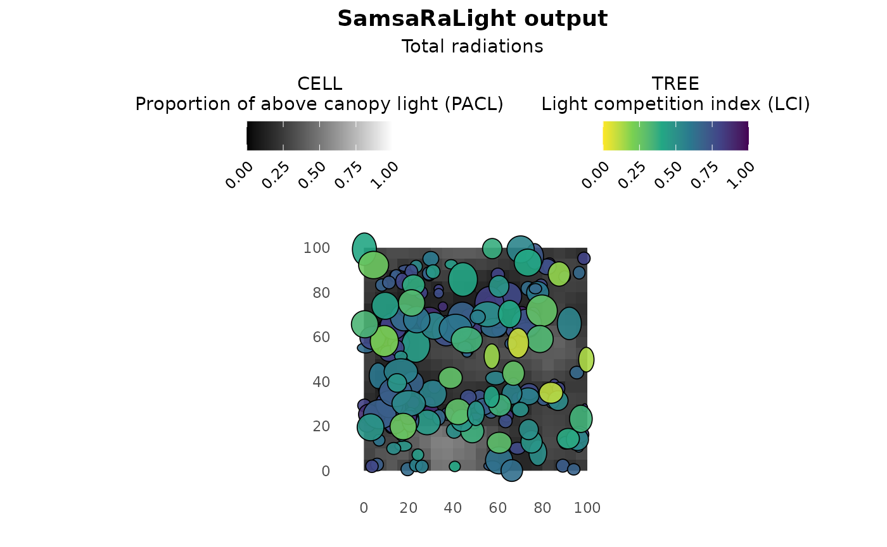

# 3 - More complex crown shapes and inventories

``` r
library(SamsaRaLight)
library(dplyr)
#> 
#> Attaching package: 'dplyr'
#> The following objects are masked from 'package:stats':
#> 
#>     filter, lag
#> The following objects are masked from 'package:base':
#> 
#>     intersect, setdiff, setequal, union
```

## Introduction

In previous tutorials, inventories were assumed to be simple,
axis-aligned rectangles defined directly in a local Cartesian coordinate
system (meters). In practice, however, forest inventories are often more
complex. In addition, tree crowns were represented using simple
symmetric shapes (“E” and “P”). However, real tree crowns are often
asymmetric, both horizontally (different crown radii in different
directions) and vertically (maximum crown width not located at mid-crown
for “E” nor crown base height for “P”).

In this vignette, we illustrate two common but more advanced situations:

1.  **Inventory based on GPS coordinates** where tree positions are
    given as longitude and latitude. We will convert the geographic
    coordinates into planar and axis-align the inventory zone with the
    virtual plot axes.
2.  **Inventory with asymmetric crown shapes**, but working with a non
    axis-aligned rectangle inventory zone as rotating asymmetric crowns
    is tricky here.
3.  **Inventory with non-rectangular shapes**, where the sampled area is
    defined by an irregular polygon (*e.g.* a combination of circular
    plots), filled around by virtual trees.

The goal is to show how these inventories can be converted into a
consistent virtual stand suitable for SamsaRaLight simulations, while
remaining faithful to the original field protocol, in line with more
realistic crown geometries using composite crown shapes.

## Axis-aligned stand from GPS data

### Context and data

We first use the example inventory **IRRES1**, stored in the package as
[`SamsaRaLight::data_IRRES1`](https://natheob.github.io/SamsaRaLight/reference/data_IRRES1.md).
This inventory was collected in Belgian Ardennes by Gauthier Ligot in
the scope of the IRRES project, which investigates the transition from
even-aged to uneven-aged forest management. The stand is dense in a
sloppy terrain and is mainly composed of Norway spruce and Douglas-fir,
with a coppice stool of beech at its center and a few silver fir and
larch trees.

``` r
trees_irres <- SamsaRaLight::data_IRRES1$trees

str(trees_irres)
#> 'data.frame':    522 obs. of  14 variables:
#>  $ id_tree   : int  1 3 4 5 6 7 8 9 10 12 ...
#>  $ species   : chr  "Pseudtsuga menziesii" "Pseudtsuga menziesii" "Picea abies" "Picea abies" ...
#>  $ dbh_cm    : num  36.5 37.3 18.7 27 31 22 17.7 33.9 33.5 21.7 ...
#>  $ crown_type: chr  "P" "P" "P" "P" ...
#>  $ h_m       : num  28.2 31.2 19.5 23.4 30.9 ...
#>  $ hbase_m   : num  10.42 14.44 9.99 11.38 13.04 ...
#>  $ hmax_m    : logi  NA NA NA NA NA NA ...
#>  $ rn_m      : num  3.8 3.94 2.09 2.39 3.97 2.21 2.18 4.78 2.62 2.16 ...
#>  $ rs_m      : num  3.8 3.94 2.09 2.39 3.97 2.21 2.18 4.78 2.62 2.16 ...
#>  $ re_m      : num  3.8 3.94 2.09 2.39 3.97 2.21 2.18 4.78 2.62 2.16 ...
#>  $ rw_m      : num  3.8 3.94 2.09 2.39 3.97 2.21 2.18 4.78 2.62 2.16 ...
#>  $ crown_lad : num  0.5 0.5 0.5 0.5 0.5 0.5 0.5 0.5 0.5 0.5 ...
#>  $ lon       : num  5.96 5.96 5.96 5.96 5.96 ...
#>  $ lat       : num  50.3 50.3 50.3 50.3 50.3 ...
```

Running
[`check_inventory()`](https://natheob.github.io/SamsaRaLight/reference/check_inventory.md)
on this dataset immediately fails, with an error indicating that columns
`x` and `y` are missing. This is expected: tree positions are provided
as longitude (`lon`) and latitude (`lat`), expressed in degrees. To
illustrate why this is problematic, we (incorrectly) rename longitude
and latitude to `x` and `y` and attempt to plot the inventory. It leads
to a meaningless plot as angular coordinates (degrees) are incompatible
with crown dimensions expressed in meters.

``` r
SamsaRaLight::plot_inventory(
  trees_irres %>% rename(x = lon, y = lat)
)
```



### Coordinate conversion

Before creating a stand, coordinates must be converted into a planar
Cartesian system with metric units. Tree coordinates can be converted
from the global WGS84 reference system (EPSG:4326) to a projected
coordinate system expressed in meters such as the Universal Transverse
Mercator (UTM) system. It is a grid-based, metric coordinate system
mapping the Earth using 60 longitudinal zones (each of them being
6-degree between 80°S and 84°N latitude), for each of the two
hemispheres North and South.

The EPSG needed to convert coordinates depends on the plot coordinates.
However, the UTM zone can be automatically inferred from the mean
longitude ($zone = floor\left( (lon + 180)/6 \right) + 1$ and hemisphere
inferred from the mean latitude ($hemisphere = 32600$ if latitude is
positive or $hemisphere = 32700$ if latitude is negative). Thus, EPSG
code can be automatically computed as $EPSG = hemisphere + zone$. The
function
[`SamsaRaLight::create_xy_from_lonlat()`](https://natheob.github.io/SamsaRaLight/reference/create_xy_from_lonlat.md)
allows to automatically convert a data.frame containing lon/lat
coordinates into planar XY coordinates determining the appropriate UTM
system.

``` r
trees_irres_xy <- SamsaRaLight::create_xy_from_lonlat(trees_irres)

str(trees_irres_xy)
#> List of 2
#>  $ df  :'data.frame':    522 obs. of  16 variables:
#>   ..$ id_tree   : int [1:522] 1 3 4 5 6 7 8 9 10 12 ...
#>   ..$ species   : chr [1:522] "Pseudtsuga menziesii" "Pseudtsuga menziesii" "Picea abies" "Picea abies" ...
#>   ..$ dbh_cm    : num [1:522] 36.5 37.3 18.7 27 31 22 17.7 33.9 33.5 21.7 ...
#>   ..$ crown_type: chr [1:522] "P" "P" "P" "P" ...
#>   ..$ h_m       : num [1:522] 28.2 31.2 19.5 23.4 30.9 ...
#>   ..$ hbase_m   : num [1:522] 10.42 14.44 9.99 11.38 13.04 ...
#>   ..$ hmax_m    : logi [1:522] NA NA NA NA NA NA ...
#>   ..$ rn_m      : num [1:522] 3.8 3.94 2.09 2.39 3.97 2.21 2.18 4.78 2.62 2.16 ...
#>   ..$ rs_m      : num [1:522] 3.8 3.94 2.09 2.39 3.97 2.21 2.18 4.78 2.62 2.16 ...
#>   ..$ re_m      : num [1:522] 3.8 3.94 2.09 2.39 3.97 2.21 2.18 4.78 2.62 2.16 ...
#>   ..$ rw_m      : num [1:522] 3.8 3.94 2.09 2.39 3.97 2.21 2.18 4.78 2.62 2.16 ...
#>   ..$ crown_lad : num [1:522] 0.5 0.5 0.5 0.5 0.5 0.5 0.5 0.5 0.5 0.5 ...
#>   ..$ lon       : num [1:522] 5.96 5.96 5.96 5.96 5.96 ...
#>   ..$ lat       : num [1:522] 50.3 50.3 50.3 50.3 50.3 ...
#>   ..$ x         : num [1:522] 710566 710558 710561 710559 710556 ...
#>   ..$ y         : num [1:522] 5579380 5579370 5579374 5579384 5579379 ...
#>  $ epsg: num 32631
```

After this conversion, tree positions are expressed in meters and the
inventory can now be validated and visualized correctly.

``` r
SamsaRaLight::check_inventory(trees_irres_xy$df)
#> Inventory table successfully validated.
plot_inventory(trees_irres_xy$df)
```


### Define the inventory zone

In the IRRES1 example dataset, the trees were inventoried within a
rectangular inventory zone. However, the vertices are also expressed in
a lon/lat coordinate system and therefore need to be converted.

``` r
polygon_irres_xy <- SamsaRaLight::create_xy_from_lonlat(
  SamsaRaLight::data_IRRES1$core_polygon
)

str(polygon_irres_xy)
#> List of 2
#>  $ df  :'data.frame':    4 obs. of  4 variables:
#>   ..$ lon: num [1:4] 5.96 5.96 5.96 5.96
#>   ..$ lat: num [1:4] 50.3 50.3 50.3 50.3
#>   ..$ x  : num [1:4] 710569 710545 710421 710445
#>   ..$ y  : num [1:4] 5579382 5579308 5579348 5579421
#>  $ epsg: num 32631
```

We can verify that the trees and the inventory polygon are both
expressed in metres within the same coordinate system. To do so, we can
use the same
[`plot_inventory()`](https://natheob.github.io/SamsaRaLight/reference/plot_inventory.md)
function as above but adding the core polygon data.frame as a second
argument.

``` r
SamsaRaLight::plot_inventory(
  trees_irres_xy$df,
  polygon_irres_xy$df
)
```


We can use the function
[`SamsaRaLight::check_polygon()`](https://natheob.github.io/SamsaRaLight/reference/check_polygon.md)
to check that the core polygon is geometrically correct and encompasses
all the inventoried trees. If it does not, the function tries to correct
it by making minimal changes, such as converting the polygon into a
valid one (e.g. if the vertices are not in the correct order) or adding
a small buffer to the polygon in an attempt to include all the trees
(e.g. if some trees are close to the border, small rounding errors can
lead to the polygon excluding them computationally). Thus, the function
returns the minimally corrected polygon and specifies this with a
message if the polygon has been modified; otherwise, it throws an error.

``` r
polygon_irres_xy$df <- SamsaRaLight::check_polygon(
  polygon_irres_xy$df,
  trees_irres_xy$df
)
#> Polygon successfully validated.
```

### Create the virtual stand

Fortunately, the SamsaRaLight package allows you to provide both tree
inventory and core polygon tables with only longitude/latitude
coordinates to the
[`create_sl_stand()`](https://natheob.github.io/SamsaRaLight/reference/create_sl_stand.md)
function, which automatically performs system conversions. The stand
creation process will also handle coordinate shifts into a relative
coordinate system starting at 0.

Because the projected coordinates follow a conventional GIS orientation
(Y axis pointing North), we set `north2x = 90`, meaning that geographic
North corresponds to the positive Y direction.

``` r
stand_irres <- SamsaRaLight::create_sl_stand(
  trees_inv = SamsaRaLight::data_IRRES1$trees,
  cell_size = 5,
  
  latitude = SamsaRaLight::data_IRRES1$info$latitude,
  slope    = SamsaRaLight::data_IRRES1$info$slope,
  aspect  = SamsaRaLight::data_IRRES1$info$aspect,
  north2x = 90,
  
  core_polygon_df = SamsaRaLight::data_IRRES1$core_polygon
)
#> `trees_inv` converted from lon/lat to planar coordinates (UTM).
#> `core_polygon_df` converted from lon/lat to planar coordinates (UTM).
#> SamsaRaLight stand successfully created.

plot(stand_irres)
```



The stand dimensions are chosen as the **smallest grid (in number of
cells)** that fully contains the inventory zone:

``` r
stand_irres$geometry$n_cells_x
#> [1] 30
stand_irres$geometry$n_cells_y
#> [1] 23
```

This corresponds to a stand size of:

``` r
stand_irres$geometry$n_cells_x * stand_irres$geometry$cell_size
#> [1] 150
stand_irres$geometry$n_cells_y * stand_irres$geometry$cell_size
#> [1] 115
```

Then, tree coordinates are shifted to a local coordinate system starting
at zero:

``` r
stand_irres$transform$shift_x
#> [1] -710420
stand_irres$transform$shift_y
#> [1] -5579307
```

### Axis-aligned rectangle option

At this stage, the inventory is not yet axis-aligned. This is not a
technical issue with this package, and the light computation can be run
using the virtual non-axis-aligned stand created above. However, as can
be seen in the above plot, the area surrounding the rectangular
inventory zone is empty, which could affect light interception.
Therefore, in most cases, it is preferable to work with a rectangle
aligned with the simulation axes. To do so, we have to recreate the
virtual stand by setting `modify_polygon = "aarect"` (for axis-aligned
rectangle), which:

1.  **compute the minimum bounding rectangle of the inventory polygon**
    (in this case, as our inventory zone is already a rectangle, it does
    not change anything),
2.  **rotate the entire stand (trees and polygon)** so that this
    rectangle becomes axis-aligned (the rotation counter-clockwise in
    degrees applied to the stand is stored internally in
    `transform$rotation_ccw$`)
3.  **update the `north2x` value accordingly** (and can be seen in the
    compass of the
    [`plot()`](https://rdrr.io/r/graphics/plot.default.html) function)

``` r
stand_irres_aarect <- SamsaRaLight::create_sl_stand(
  trees_inv = SamsaRaLight::data_IRRES1$trees,
  cell_size = 5,
  
  latitude = SamsaRaLight::data_IRRES1$info$latitude,
  slope    = SamsaRaLight::data_IRRES1$info$slope,
  aspect  = SamsaRaLight::data_IRRES1$info$aspect,
  north2x = 90,
  
  core_polygon_df = SamsaRaLight::data_IRRES1$core_polygon,
  modify_polygon = "aarect"
)
#> `trees_inv` converted from lon/lat to planar coordinates (UTM).
#> `core_polygon_df` converted from lon/lat to planar coordinates (UTM).
#> SamsaRaLight stand successfully created.

plot(stand_irres_aarect)
```



As we can see, rotating the stand results in a rectangular inventory
zone (shown in yellow) that may not cover the entire virtual stand area.
This creates empty spaces around the borders of the virtual stand and
reduces the total basal area per hectare (due to a larger area with the
same number of trees). This could slightly bias the light computation,
even though the small empty areas on the borders could be negligible for
tree light interception. This can also be avoided by:

1.  Setting the cell size to a smaller value to reduce the empty space,
    which would result in much higher computation time.
2.  Alternatively, the rectangle could be set up without being
    axis-aligned and the ‘fill_around’ argument could be used. This will
    be explained in the second and third examples of this tutorial and
    involves filling around the inventory zone with virtual trees, but
    introduces stochasticity to the stand virtualisation.

### Run SamsaraLight

As shown in the previous tutorials, monthly radiation data are retrieved
using the geographic location of the stand.

``` r
data_radiations_irres <- SamsaRaLight::get_monthly_radiations(
  latitude  = SamsaRaLight::data_IRRES1$info$latitude,
  longitude = SamsaRaLight::data_IRRES1$info$longitude
)
```

And the simulation is run using
[`run_sl()`](https://natheob.github.io/SamsaRaLight/reference/run_sl.md)
(here run with the axis-aligned inventory zone).

``` r
output_irres_aarect <- SamsaRaLight::run_sl(
  sl_stand = stand_irres_aarect,
  monthly_radiations = data_radiations_irres
)
#> parallel mode disabled because OpenMP was not available
#> SamsaRaLight simulation was run successfully.

plot(output_irres_aarect)
```



## Asymmetric crown shapes with rectangle, non-axis-aligned inventory zone

### Crown shapes available in SamsaRaLight

SamsaRaLight supports the following crown types:
`"E", "P", "2E", "4P", "8E"`. The number indicates how many crown parts
are used. The letter indicates the geometric shape (Ellipsoid or
Paraboloid). Choose the simplest crown type that matches your data
quality.

#### Symmetric crown shapes

Symetric shapes used in the Tutorial 1, defined by the mean crown radius
(mean of the four radius `rn_m`, `rs_m`, `re_m` and `rw_m`) and the
crown depth (computed as `h_m - hbase_m`. These shapes are simple and
efficient, but cannot represent crown asymmetry, knowing that crown
asymmetry strongly affects light interception.

##### *“E” — Symmetric ellipsoid*

- Single ellipsoidal volume

- Same radius in all directions

- Maximum radius automatically computed at mid-crown height
  (`hmax_m = hbase_m + (h_m - hbase_m) / 2`

##### *“P” — Symmetric paraboloid*

- Single paraboloid volume

- Same radius in all directions

- Maximum radius located at crown base height (`hmax_m = base_m`)

#### Asymmetric crown shapes

More complex shapes are created by splitting the crown into multiple
geometric parts.

##### *“2E” — Vertical asymmetry*

- Crown split into an upper and a lower ellipsoid

- Allows vertical asymmetry

- Requires `hmax_m`, the height of maximum crown radius

Crown remains horizontally symmetric. Use this shape when crown
expansion is not centered vertically.

##### *“4P” — Horizontal asymmetry*

- Crown split into four horizontal paraboloids

- Different radii allowed in the four cardinal directions: `rn_m`
  (north), `rs_m` (south), `re_m` (east) and `rw_m` (west)

- Crown is vertically symmetric: `hmax_m` is NOT required (paraboloid,
  thus `hmax = hbase_m`)

Use this shape when crowns are laterally deformed by competition.

##### *“8E” — Full asymmetry*

- Crown split into upper and lower parts (vertical asymmetry)

- each split into four cardinal directions (horizontal asymmetry)

- Requires: `rn_m`, `rs_m`, `re_m`, `rw_m` and `hmax_m`

This is the most detailed crown representation available.

### Example with rectangle, non-axis-aligned inventory zone

#### Context and data

We illustrate asymmetric crowns using the **Bechefa** marteloscope,
stored in the package as
[`SamsaRaLight::data_bechefa`](https://natheob.github.io/SamsaRaLight/reference/data_bechefa.md).

This marteloscope was installed in Belgian Ardennes by Gauthier Ligot in
the scope of the IRRES project, which investigates the transition from
even-aged to uneven-aged forest management. This is a mature mixed stand
of Douglas fir and spruce in the Belgian Ardennes. The stand has been
uneven-aged for more than 10 years.

#### Tree inventory

All trees use the `"8E"` crown type, allowing both horizontal and
vertical asymmetry. Each tree provides four directional crown radii
(`rn_m` for maximum crown radius pointing north, `rs_m` for south,
`re_m` for east, `rw_m` for west) and the height of maximum crown
expansion (`hmax_m`).

``` r
head(SamsaRaLight::data_bechefa$trees)
#>   id_tree     species     x    y    dbh_cm crown_type  h_m hbase_m hmax_m rn_m
#> 1     103       abies 163.1 67.3  68.43663         8E 38.5    16.6   28.2 4.32
#> 2     615 pseudotsuga  66.8 41.4  95.49297         8E 50.2    14.0   33.3 7.01
#> 3     102 pseudotsuga 159.2 58.2 111.72677         8E 48.2    10.8   27.1 8.38
#> 4     708 pseudotsuga  43.8 34.2 116.81973         8E 51.0    15.8   27.0 7.37
#> 5     707 pseudotsuga  51.4 34.1  99.94930         8E 50.5    16.0   26.7 6.73
#> 6     712 pseudotsuga  57.2 17.0 112.04508         8E 51.4    14.4   26.5 5.02
#>   rs_m re_m rw_m crown_lad
#> 1 4.12 3.70 5.20       0.6
#> 2 6.45 5.87 4.15       0.6
#> 3 6.72 4.69 6.51       0.6
#> 4 7.43 9.85 5.44       0.6
#> 5 5.16 3.40 5.76       0.6
#> 6 6.02 5.00 5.32       0.6
```

#### Create the stand

The subsequent steps are identical to those used with symmetric crowns
(see Tutorial 1). Introducing asymmetric crowns only requires adapting
the initial tree inventory. Horizontal asymmetry is clearly visible in
the plots, whereas vertical asymmetry is more difficult to perceive
graphically because crowns are displayed as projected shapes.

It is important to note that the `north2x` parameter must be a multiple
of 90° (i.e. 0°, 90°, 180°, or 270°) when the virtual stand contains at
least one horizontally asymmetric crown type (i.e. `"4P"` or `"8E"`).
Horizontal asymmetry is defined by assigning different crown radii to
the four cardinal directions (north, south, east, and west). These four
directional radii are internally converted into planar X–Y axis-aligned
radii according to the value of `north2x`.

``` r
stand_bechefa <- SamsaRaLight::create_sl_stand(
  trees_inv = SamsaRaLight::data_bechefa$trees,
  
  cell_size = 5,
  
  latitude = SamsaRaLight::data_bechefa$info$latitude,
  slope = SamsaRaLight::data_bechefa$info$slope,
  aspect = SamsaRaLight::data_bechefa$info$aspect,
  north2x = SamsaRaLight::data_bechefa$info$north2x,
  
  core_polygon_df = SamsaRaLight::data_bechefa$core_polygon
)
#> SamsaRaLight stand successfully created.

plot(stand_bechefa)
```



``` r
plot(stand_bechefa, top_down = TRUE)
```



#### Fill around the inventory zone

Such as in the first example of this tutorial, we may want to rotate the
stand in order to axis-align it. However, because of the same reason as
the described above for `north2x` when considering at least one
horizontal asymmetric crown, we can rotate the stand only by a multiple
of 90°, leading to impossibility to axis-align the stand in most case.
For this reason, the argument “modify_polygon = aarect” is desactivated
if at least one horizontal asymmetric crown is present in the stand.
However, the user can still transform and ensure its inventory zone is a
perfect rectangle (minimum enclosing rectangle area) with the argument
`modify_polygon = "rect"`. Otherwise, to not modify the given polygon,
the default argument is `modify_polygon = "none"`.

To counteract the fact that plot is empty around the non-axis aligned
rectangle inventory zone, we can use the argument `fill_around = TRUE`
when creating the vitual stand with the
[`create_sl_stand()`](https://natheob.github.io/SamsaRaLight/reference/create_sl_stand.md).
This will add **virtual trees outside the inventory polygon, within the
simulation grid**:

- sampled from the inventoried trees,

- randomly positioned outside the inventory zone,

- until the surrounding area reaches the **same basal area per hectare**
  as the inventory zone.

``` r
stand_bechefa_filled <- SamsaRaLight::create_sl_stand(
  trees_inv = SamsaRaLight::data_bechefa$trees,
  
  cell_size = 5,
  
  latitude = SamsaRaLight::data_bechefa$info$latitude,
  slope = SamsaRaLight::data_bechefa$info$slope,
  aspect = SamsaRaLight::data_bechefa$info$aspect,
  north2x = SamsaRaLight::data_bechefa$info$north2x,
  
  core_polygon_df = SamsaRaLight::data_bechefa$core_polygon,
  modify_polygon = "rect",
  fill_around = TRUE
)
#> SamsaRaLight stand successfully created.

plot(stand_bechefa_filled)
```



When plotting, the argument `only_inv = TRUE` allows displaying only the
inventoried trees (inside the yellow polygon). Added trees are
identified in the stand object using the logical column `added_to_fill`.

``` r
table(stand_bechefa_filled$trees$added_to_fill)
#> 
#> FALSE  TRUE 
#>   201   204
```

A summary of both the inventory zone and the full virtual stand can be
obtained with the [`summary()`](https://rdrr.io/r/base/summary.html)
function, showing that both zones exhibit similar basal area per hectare
and mean quadratic diameter.

``` r
summary(stand_bechefa_filled)
#> 
#> SamsaRaLight stand summary
#> ================================
#> 
#> 
#> Inventory (core polygon):
#>   Area              : 1.41 ha
#>   Trees             : 201
#>   Density           : 142.9 trees/ha
#>   Basal area        : 33.89 m2/ha
#>   Quadratic mean DBH: 54.9 cm
#> 
#> Simulation stand (core + filled buffer):
#>   Area              : 2.80 ha
#>   Trees             : 405
#>   Density           : 144.6 trees/ha
#>   Basal area        : 34.06 m2/ha
#>   Quadratic mean DBH: 54.8 cm
#> 
#> Stand geometry:
#>   Grid              : 40 x 28 (1120 cells)
#>   Cell size         : 5.00 m
#>   Slope             : 0.00 deg
#>   Aspect            : 0.00 deg
#>   North to X-axis   : 90.00 deg
#> 
#> Number of sensors: 0
```

This approach assumes that the surrounding stand is structurally similar
to the inventoried area. As mentionned above, this add stochasticity in
the stand virtualisation, thus to be considered with care and maybe with
duplicates for rigorous scientific studies for example.

#### Run SamsaraLight

``` r
radiations_bechefa <- SamsaRaLight::get_monthly_radiations(
  latitude = SamsaRaLight::data_bechefa$info$latitude,
  longitude = SamsaRaLight::data_bechefa$info$longitude)

output_bechefa <- SamsaRaLight::run_sl(
  sl_stand = stand_bechefa_filled,
  monthly_radiations = radiations_bechefa
)
#> parallel mode disabled because OpenMP was not available
#> SamsaRaLight simulation was run successfully.

plot(output_bechefa)
```



## Non-rectangular inventory zones

### Context and data

We now consider the example inventory **Cloture20**, stored in the
package as
[`SamsaRaLight::data_cloture20`](https://natheob.github.io/SamsaRaLight/reference/data_cloture20.md).

This inventory was collected by Gauthier Ligot in Wallonia, Belgium, as
part of the CLOTURE project, which investigates the effect of fences on
beech and oak plots with varying beech proportions. In this case, the
plot is primarily made up of beech trees (Fagus sylvatica). The crowns
are described with full asymmetric shapes “8E”. The inventory protocol
is complex and resulted in non-rectangular inventory zones formed from
multiple circular areas. Thus, the core polygon is defined by 94
vertices:

``` r
str(SamsaRaLight::data_cloture20$core_polygon)
#> 'data.frame':    94 obs. of  2 variables:
#>  $ x: num  54 56.4 59.1 61.9 64.8 ...
#>  $ y: num  70.4 72.2 73.6 74.6 75.2 ...
```

### Virtual stand with complex core polygon

First, we can create the virtual stand by setting the pre-defined core
polygon stored in the package. Representing the inventory as a rectangle
in this case would be inconsistent with the field protocol. Therefore,
the polygon is preserved inside a larger virtual stand with
`modify_polygon = "none"` and the virtual stand is filled around the
inventory zone with `fill_around = TRUE`.

``` r
stand_cloture_filled <- SamsaRaLight::create_sl_stand(
  trees_inv = SamsaRaLight::data_cloture20$trees,
  cell_size = 5,
  
  latitude = SamsaRaLight::data_cloture20$info$latitude,
  slope    = SamsaRaLight::data_cloture20$info$slope,
  aspect  = SamsaRaLight::data_cloture20$info$aspect,
  north2x = SamsaRaLight::data_cloture20$info$north2x,
  
  core_polygon_df = SamsaRaLight::data_cloture20$core_polygon,
  modify_polygon = "none",
  fill_around = TRUE
)
#> SamsaRaLight stand successfully created.

plot(stand_cloture_filled)
```



### Simulation and summaries

Finally, the radiation data and the simulation run are done as usual:

``` r
data_radiations_cloture <- SamsaRaLight::get_monthly_radiations(
  latitude  = SamsaRaLight::data_cloture20$info$latitude,
  longitude = SamsaRaLight::data_cloture20$info$longitude
)

output_cloture_filled <- SamsaRaLight::run_sl(
  sl_stand = stand_cloture_filled,
  monthly_radiations = data_radiations_cloture
)
#> parallel mode disabled because OpenMP was not available
#> SamsaRaLight simulation was run successfully.

plot(output_cloture_filled)
```



And both inputs and outputs can be summarised using:

``` r
summary(stand_cloture_filled)
#> 
#> SamsaRaLight stand summary
#> ================================
#> 
#> 
#> Inventory (core polygon):
#>   Area              : 0.59 ha
#>   Trees             : 112
#>   Density           : 190.5 trees/ha
#>   Basal area        : 21.99 m2/ha
#>   Quadratic mean DBH: 38.3 cm
#> 
#> Simulation stand (core + filled buffer):
#>   Area              : 1.00 ha
#>   Trees             : 189
#>   Density           : 189.0 trees/ha
#>   Basal area        : 22.05 m2/ha
#>   Quadratic mean DBH: 38.5 cm
#> 
#> Stand geometry:
#>   Grid              : 20 x 20 (400 cells)
#>   Cell size         : 5.00 m
#>   Slope             : 0.00 deg
#>   Aspect            : 0.00 deg
#>   North to X-axis   : 90.00 deg
#> 
#> Number of sensors: 0
summary(output_cloture_filled)
#> 
#> SamsaRaLight simulation summary
#> ================================
#> 
#> Trees (crown interception)
#> ---------------------------
#>       epot               e                 lci         
#>  Min.   :  15352   Min.   :   310.5   Min.   :0.08301  
#>  1st Qu.:  95729   1st Qu.: 20343.9   1st Qu.:0.50907  
#>  Median : 181528   Median : 52608.5   Median :0.69219  
#>  Mean   : 346562   Mean   :151399.9   Mean   :0.65603  
#>  3rd Qu.: 580654   3rd Qu.:247790.1   3rd Qu.:0.80633  
#>  Max.   :1232315   Max.   :727892.4   Max.   :0.99127  
#> 
#> Cells (ground light)
#> -------------------
#>        e               pacl             punobs      
#>  Min.   : 192.2   Min.   :0.05108   Min.   :0.0000  
#>  1st Qu.: 612.7   1st Qu.:0.16284   1st Qu.:0.4289  
#>  Median : 868.1   Median :0.23073   Median :0.5903  
#>  Mean   : 894.0   Mean   :0.23760   Mean   :0.5535  
#>  3rd Qu.:1100.3   3rd Qu.:0.29245   3rd Qu.:0.7007  
#>  Max.   :2048.5   Max.   :0.54446   Max.   :0.8800  
#> 
#> Sensors
#> -------
#> No sensor energy variables available
```
