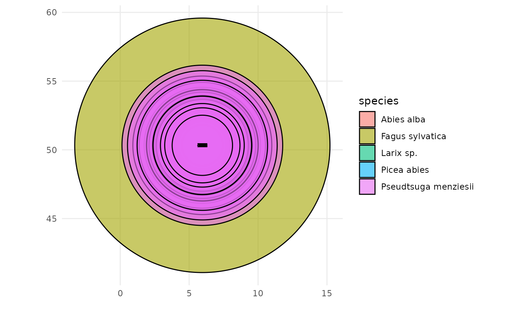
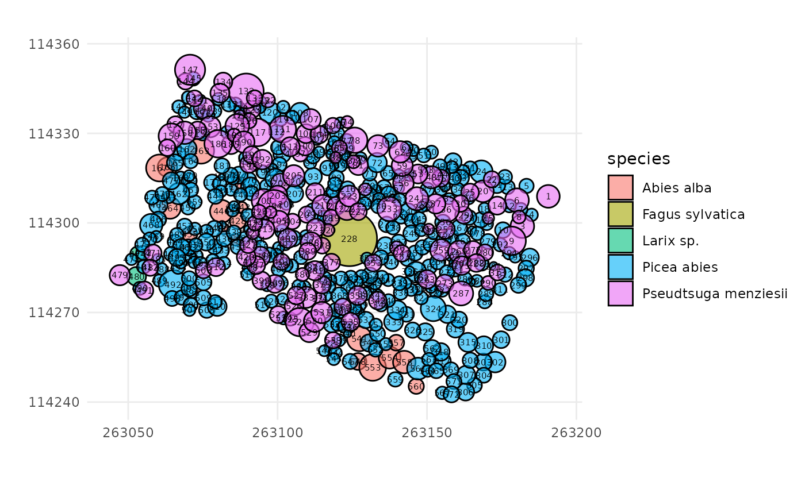
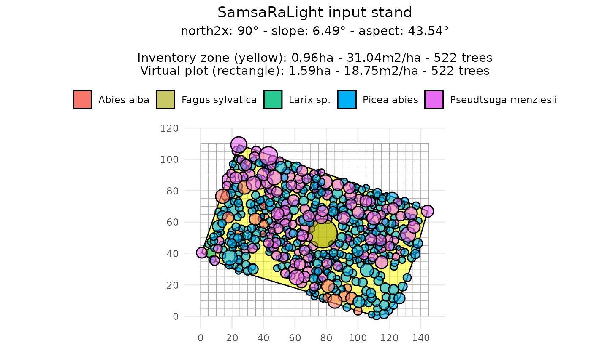
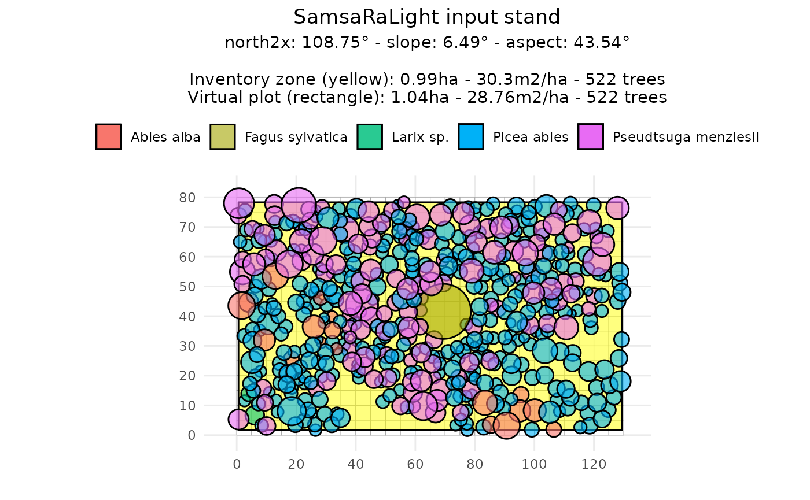
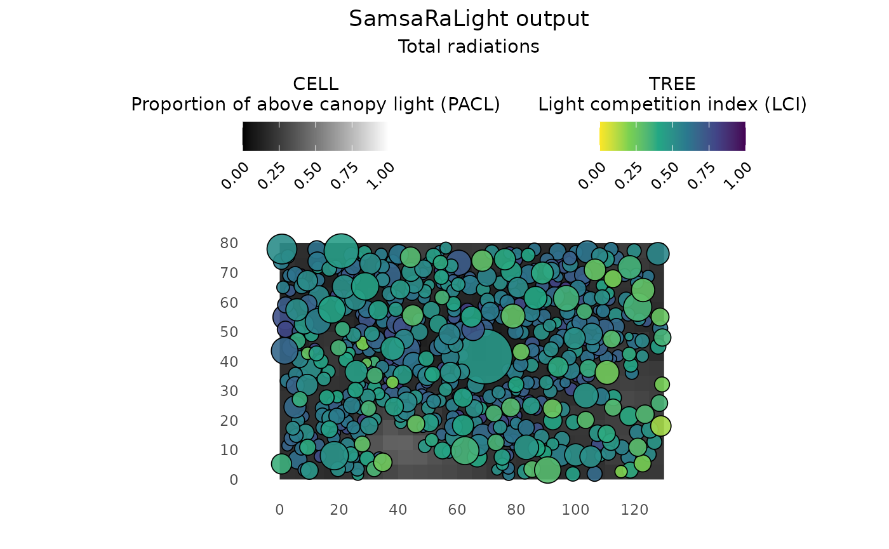
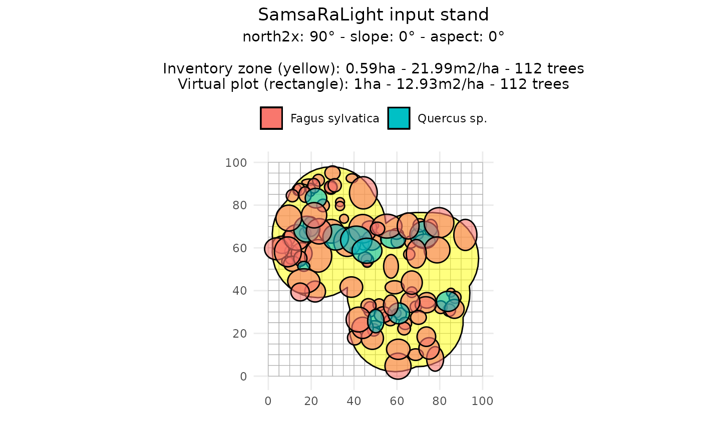
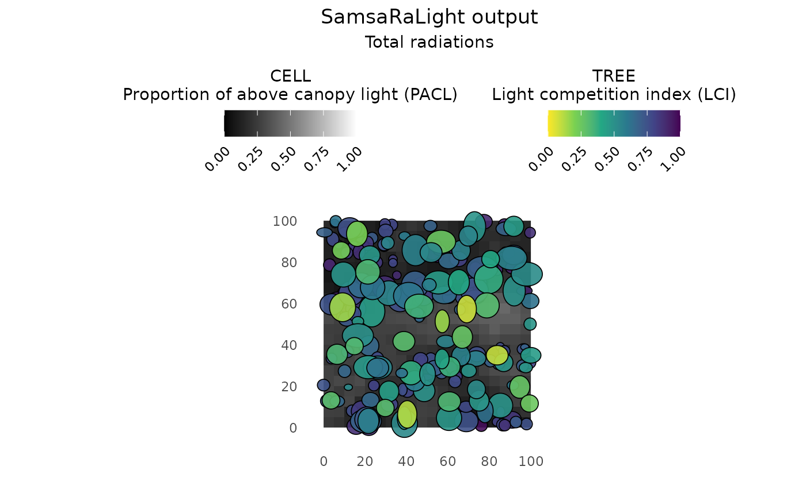

# 4 - More complex inventory shapes

``` r
knitr::opts_chunk$set(
collapse = TRUE,
comment = "#>"
)
```

``` r
library(SamsaRaLight)
library(dplyr)
library(sf)
```

## Introduction

In previous tutorials, inventories were assumed to be simple,
axis-aligned rectangles defined directly in a local Cartesian coordinate
system (meters). In practice, however, forest inventories are often more
complex.

In this vignette, we illustrate two common but more advanced situations:

1.  **Inventories based on GPS coordinates**, where tree positions are
    given as longitude and latitude, and the inventory rectangle is not
    aligned with the virtual plot axes.
2.  **Inventories with non-rectangular shapes**, where the sampled area
    is defined by an irregular polygon (*e.g.* a combination of circular
    plots).

The goal is to show how these inventories can be converted into a
consistent virtual stand suitable for SamsaRaLight simulations, while
remaining faithful to the original field protocol.

## Axis-aligned stand from GPS data

### Context and data

We first use the example inventory **IRRES1**, stored in the package as
[`SamsaRaLight::data_IRRES1`](https://natheob.github.io/SamsaRaLight/reference/data_IRRES1.md).

This inventory was collected in Belgian Ardennes by Gauthier Ligot in
the scope of the IRRES project, which investigates the transition from
even-aged to uneven-aged forest management. The stand is dense in a
sloppy terrain and is mainly composed of Norway spruce and Douglas-fir,
with a coppice stool of beech at its center and a few silver fir and
larch trees.

``` r
trees_irres <- SamsaRaLight::data_IRRES1$trees
```

Running
[`check_inventory()`](https://natheob.github.io/SamsaRaLight/reference/check_inventory.md)
on this dataset immediately fails, with an error indicating that columns
`x` and `y` are missing. This is expected: tree positions are provided
as longitude (`lon`) and latitude (`lat`), expressed in degrees.

To illustrate why this is problematic, we (incorrectly) rename longitude
and latitude to `x` and `y` and attempt to plot the inventory.

``` r
SamsaRaLight::plot_inventory(
  trees_irres %>% rename(x = lon, y = lat)
)
```



This plot is meaningless: angular coordinates (degrees) are incompatible
with crown dimensions expressed in meters. Before creating a stand,
coordinates must therefore be converted into a planar Cartesian system
with metric units.

### Coordinate conversion

Tree coordinates are converted from the global WGS84 reference system
(EPSG:4326) to a projected coordinate system expressed in meters. Here,
we use **Belgian Lambert 72** (EPSG:31370), which is appropriate for the
study area . For other countries, check for the specific local projected
system such as Lambert93 for France (EPSG:2154) or UTM zone 32N for most
of Europe (EPSG:23032).

``` r
trees_irres_sf <- sf::st_as_sf(
  trees_irres,
  coords = c("lon", "lat"),
  crs = 4326   # WGS84
)

trees_irres_l72 <- sf::st_transform(
  trees_irres_sf,
  crs = 31370 # Belgian Lambert 72
)

xy <- sf::st_coordinates(trees_irres_l72)
trees_irres$x <- xy[, 1]
trees_irres$y <- xy[, 2]
```

After this conversion, tree positions are expressed in meters. The
inventory can now be validated and visualized correctly.

``` r
SamsaRaLight::check_inventory(trees_irres)
#> Inventory table successfully validated.
plot_inventory(trees_irres)
```



At this stage, the inventory is still not axis-aligned, and coordinates
do not start at zero. This is not an issue: the stand creation process
will handle coordinate shifts and rotations internally.

### Defining the inventory zone

To create the virtual stand, we call
[`create_sl_stand()`](https://natheob.github.io/SamsaRaLight/reference/create_sl_stand.md).
Because no explicit inventory polygon is provided, we set
`core_polygon_df = NULL`, which allows to infer the polygon
automatically from tree positions.

Because the projected coordinates follow a conventional GIS orientation
(Y axis pointing North), we set `north2x = 90`, meaning that geographic
North corresponds to the positive Y direction.

``` r
stand_irres <- SamsaRaLight::create_sl_stand(
  trees_inv = trees_irres,
  cell_size = 5,
  
  latitude = SamsaRaLight::data_IRRES1$info$latitude,
  slope    = SamsaRaLight::data_IRRES1$info$slope,
  aspect  = SamsaRaLight::data_IRRES1$info$aspect,
  north2x = 90,
  
  core_polygon_df = NULL
)
#> SamsaRaLight stand successfully created.

plot(stand_irres)
```



The stand dimensions are chosen as the **smallest grid (in number of
cells)** that fully contains the inventory zone:

``` r
stand_irres$geometry$n_cells_x
#> [1] 29
stand_irres$geometry$n_cells_y
#> [1] 22
```

This corresponds to a stand size of:

``` r
stand_irres$geometry$n_cells_x * stand_irres$geometry$cell_size
#> [1] 145
stand_irres$geometry$n_cells_y * stand_irres$geometry$cell_size
#> [1] 110
```

Then, tree coordinates are shifted to a local coordinate system starting
at zero:

``` r
stand_irres$transform$shift_x
#> [1] -263046.4
stand_irres$transform$shift_y
#> [1] -114242
```

### Axis-aligned rectangle option

As shown in the plot above, the area surrounding the rectangular
inventory zone is empty, which could affect light interception.Thus, in
most cases, it is desirable to work with a rectangle aligned with the
simulation axes. To do so, we have to rercreate the virtual stand by
setting `aarect_zone = TRUE`, which:

1.  compute the minimum bounding rectangle of the inventory polygon,
2.  rotate the entire stand (trees and polygon) so that this rectangle
    becomes axis-aligned,
3.  update the `north2x` value accordingly.

``` r
stand_irres_aarect <- SamsaRaLight::create_sl_stand(
  trees_inv = trees_irres,
  cell_size = 5,
  
  latitude = SamsaRaLight::data_IRRES1$info$latitude,
  slope    = SamsaRaLight::data_IRRES1$info$slope,
  aspect  = SamsaRaLight::data_IRRES1$info$aspect,
  north2x = 90,
  
  core_polygon_df = NULL,
  aarect_zone = TRUE
)
#> SamsaRaLight stand successfully created.

plot(stand_irres_aarect)
```



The rotation applied to the stand is stored internally, and the
`north2x` value is updated accordingly.

``` r
stand_irres_aarect$transform$rotation
#> [1] -18.75464
stand_irres_aarect$geometry$north2x
#> [1] 108.7546
```

### Running SamsaRaLight

As shown in the previous tutorials, monthly radiation data are retrieved
using the geographic location of the stand.

``` r
data_radiations_irres <- SamsaRaLight::get_monthly_radiations(
  latitude  = SamsaRaLight::data_IRRES1$info$latitude,
  longitude = SamsaRaLight::data_IRRES1$info$longitude
)
```

And the simulation is run using
[`run_sl()`](https://natheob.github.io/SamsaRaLight/reference/run_sl.md).
By default, the function considers virtual plot boundaries within a
torus system (`use_torus = TRUE`), treating the surrounding environment
as a copy of the virtual plot in all directions.

``` r
output_irres_aarect <- SamsaRaLight::run_sl(
  sl_stand = stand_irres_aarect,
  monthly_radiations = data_radiations_irres
)
#> parallel mode disabled because OpenMP was not available
#> SamsaRaLight simulation was run successfully.

plot(output_irres_aarect)
```



## Non-rectangular inventory zones

### Context and data

We now consider the example inventory **Cloture20**, stored in the
package as
[`SamsaRaLight::data_cloture20`](https://natheob.github.io/SamsaRaLight/reference/data_cloture20.md).

This inventory was collected by Gauthier Ligot in Wallonia, Belgium, as
part of the CLOTURE project, which investigates the effect of fences on
beech and oak plots with varying beech proportions. In this case, the
plot is primarily made up of beech trees (Fagus sylvatica). The
inventory protocol is complex and resulted in non-rectangular inventory
zones formed from multiple circular areas. Thus, the core polygon is
defined by 94 vertices:

``` r
str(SamsaRaLight::data_cloture20$core_polygon)
#> 'data.frame':    94 obs. of  2 variables:
#>  $ x: num  54 56.4 59.1 61.9 64.8 ...
#>  $ y: num  70.4 72.2 73.6 74.6 75.2 ...
```

### Virtual stand with complex core polygon

First, we can create the virtual stand by setting the pre-defined core
polygon stored in the package. Representing the inventory as a rectangle
in this case would be inconsistent with the field protocol. Therefore,
the polygon is preserved inside a larger virtual stand.

``` r
stand_cloture <- SamsaRaLight::create_sl_stand(
  trees_inv = SamsaRaLight::data_cloture20$trees,
  cell_size = 5,
  
  latitude = SamsaRaLight::data_cloture20$info$latitude,
  slope    = SamsaRaLight::data_cloture20$info$slope,
  aspect  = SamsaRaLight::data_cloture20$info$aspect,
  north2x = SamsaRaLight::data_cloture20$info$north2x,
  
  core_polygon_df = SamsaRaLight::data_cloture20$core_polygon
)
#> Polygon successfully validated.
#> SamsaRaLight stand successfully created.

plot(stand_cloture)
```



### Filling around the inventory zone

Outside the inventory polygon, no trees are initially present. This may
affect light interception near the edges of the inventory zone, even
when setting `use_torus = TRUE` after in the
[`run_sl()`](https://natheob.github.io/SamsaRaLight/reference/run_sl.md)
function (which affects the edges of the virtual plot, but not the
inventory zone).

Setting `fill_around = TRUE` when creating the vitual stand with the
[`create_sl_stand()`](https://natheob.github.io/SamsaRaLight/reference/create_sl_stand.md)
function will add **virtual trees outside the inventory polygon**,
within the simulation grid. These trees are:

- randomly positioned outside the inventory zone,

- sampled from the inventoried trees,

- added until the surrounding area reaches the **same basal area per
  hectare** as the inventory zone.

This approach assumes that the surrounding stand is structurally similar
to the inventoried area.

``` r
stand_cloture_filled <- SamsaRaLight::create_sl_stand(
  trees_inv = SamsaRaLight::data_cloture20$trees,
  cell_size = 5,
  
  latitude = SamsaRaLight::data_cloture20$info$latitude,
  slope    = SamsaRaLight::data_cloture20$info$slope,
  aspect  = SamsaRaLight::data_cloture20$info$aspect,
  north2x = SamsaRaLight::data_cloture20$info$north2x,
  
  core_polygon_df = SamsaRaLight::data_cloture20$core_polygon,
  fill_around = TRUE
)
#> Polygon successfully validated.
#> SamsaRaLight stand successfully created.

plot(stand_cloture_filled)
```


When plotting, the argument `only_inv = TRUE` allows displaying only the
inventoried trees (inside the yellow polygon). Added trees are
identified in the stand object using the logical column `added_to_fill`.

``` r
table(stand_cloture_filled$trees$added_to_fill)
#> 
#> FALSE  TRUE 
#>   112   101
```

### Stand summary and simulation

A summary of both the inventory zone and the full virtual stand can be
obtained with the [`summary()`](https://rdrr.io/r/base/summary.html)
function, showing that both zones exhibit similar basal area per hectare
and mean quadratic diameter.

``` r
summary(stand_cloture_filled)
#> 
#> SamsaRaLight stand summary
#> ================================
#> 
#> 
#> Inventory (core polygon):
#>   Area              : 0.59 ha
#>   Trees             : 112
#>   Density           : 190.5 trees/ha
#>   Basal area        : 21.99 m2/ha
#>   Quadratic mean DBH: 38.3 cm
#> 
#> Simulation stand (core + filled buffer):
#>   Area              : 1.00 ha
#>   Trees             : 213
#>   Density           : 213.0 trees/ha
#>   Basal area        : 22.02 m2/ha
#>   Quadratic mean DBH: 36.3 cm
#> 
#> Stand geometry:
#>   Grid              : 20 x 20 (400 cells)
#>   Cell size         : 5.00 m
#>   Slope             : 0.00 deg
#>   Aspect            : 0.00 deg
#>   North to X-axis   : 90.00 deg
#> 
#> Number of sensors: 0
#> 
#> Available light interception models:
#>   - Turbid medium (crown_lad)
#>   - Porous envelope (crown_openness)
```

Finally, the simulation is run as usual.

``` r
data_radiations_cloture <- SamsaRaLight::get_monthly_radiations(
  latitude  = SamsaRaLight::data_cloture20$info$latitude,
  longitude = SamsaRaLight::data_cloture20$info$longitude
)

output_cloture_filled <- SamsaRaLight::run_sl(
  sl_stand = stand_cloture_filled,
  monthly_radiations = data_radiations_cloture
)
#> parallel mode disabled because OpenMP was not available
#> SamsaRaLight simulation was run successfully.

plot(output_cloture_filled)
```


