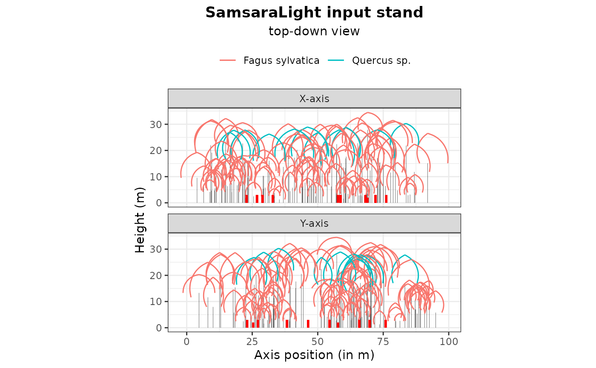
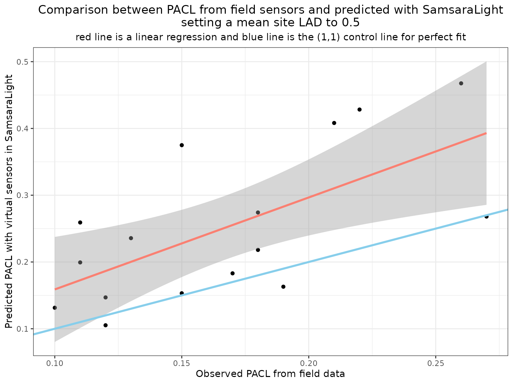
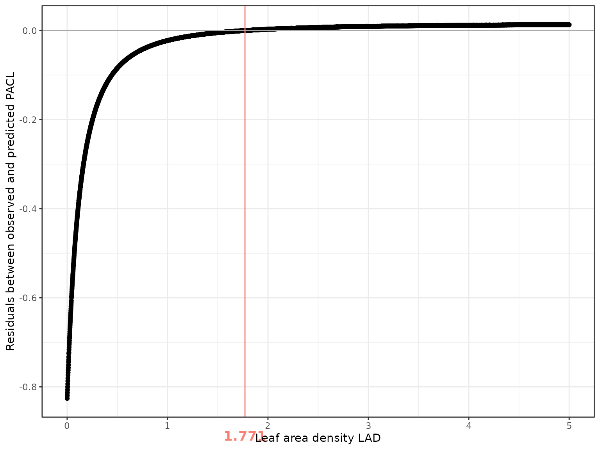
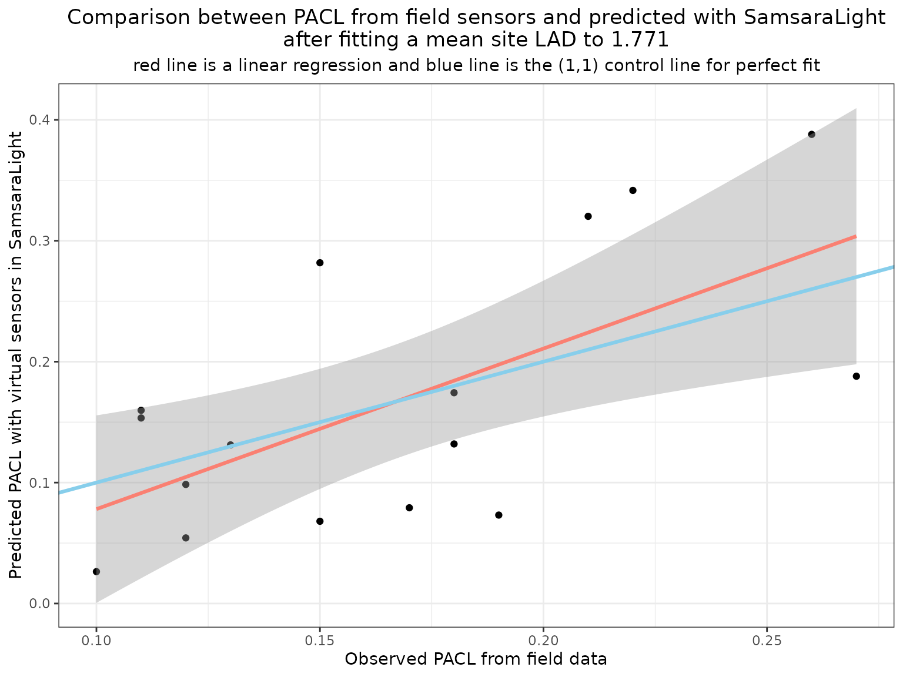

# 5 - Virtual sensors

``` r
library(SamsaRaLight)
library(dplyr)
library(ggplot2)
library(grid)
```

## Introduction

In the previous vignettes, we examined how light transmission depends on
crown structure and on the choice of transmission model. In this
tutorial, we focus on the use of virtual sensors to compare model
outputs with field measurements.

Virtual sensors allow us to estimate the amount of radiation reaching
specific locations in the stand, such as the forest floor. They can
therefore be used to evaluate model performance and to support parameter
calibration.

In this vignette, we first show how to define and use virtual sensors in
SamsaRaLight. We then illustrate how sensor outputs can be compared with
field measurements of percentage of above canopy light (PACL). Finally,
we present a simple approach to calibrate a mean site leaf area density
(LAD) using virtual sensors and discuss its limitations.

## Estimating PACL with light sensors

### Measuring light in the field

In forest ecosystems, light availability at the ground level can be
measured using direct sensors (quantum sensors, dataloggers) or indirect
methods such as hemispherical photography. These measurements provide
estimates of transmitted radiation or PACL at specific locations. In
SamsaRaLight, virtual sensors are designed to reproduce such
measurements within simulated stands.

### Defining sensors in a virtual stand

In the model, a sensor represents a point where incoming radiation is
recorded. Sensors are defined by their spatial coordinates and height
over the ground and are provided as a dedicated data.frame when creating
the stand. Measurements of PACL are not required as input data for the
model, only `id_sensor`, `x`, `y` and `h_m` variables.

The following example shows the sensor configuration used in the
`cloture20` dataset.

``` r
SamsaRaLight::data_cloture20$sensors
#>    id_sensor     x     y h_m pacl pacl_direct pacl_diffuse
#> 1          1 22.00 56.64   2 0.11        0.13         0.10
#> 2          2 71.22 53.45   3 0.22        0.28         0.16
#> 3          3 75.30 53.45   3 0.26        0.31         0.21
#> 4          4 71.22 45.27   3 0.15        0.13         0.16
#> 5          5 71.22 37.21   3 0.13        0.08         0.17
#> 6          6 56.88 37.21   3 0.18        0.12         0.22
#> 7          7 68.11 24.30   2 0.27        0.29         0.24
#> 8          8 57.84 22.00   3 0.18        0.21         0.15
#> 9          9 57.84 26.11   3 0.10        0.12         0.09
#> 10        10 67.34 53.45   3 0.21        0.26         0.17
#> 11        11 22.00 64.82   3 0.17        0.20         0.15
#> 12        12 25.97 64.82   3 0.19        0.24         0.15
#> 13        13 25.97 68.74   3 0.12        0.09         0.14
#> 14        14 28.08 74.86   3 0.11        0.03         0.18
#> 15        15 32.00 68.74   3 0.12        0.07         0.17
#> 16        16 28.08 64.82   3 0.15        0.18         0.13
```

An input sensors data.frame structure can be checked using the function
[`SamsaRaLight::check_sensors()`](https://natheob.github.io/SamsaRaLight/reference/check_sensors.md)

``` r
SamsaRaLight::check_sensors(SamsaRaLight::data_cloture20$sensors)
#> Sensors table successfully validated.
```

Sensors are included in the stand definition using the `sensors`
argument of
[`create_sl_stand()`](https://natheob.github.io/SamsaRaLight/reference/create_sl_stand.md).

``` r
stand_cloture <- SamsaRaLight::create_sl_stand(
  
  # Tree inventory
  trees_inv = SamsaRaLight::data_cloture20$trees,
  core_polygon_df = SamsaRaLight::data_cloture20$core_polygon,
  
  # STand geometry
  cell_size = 5,
  latitude = SamsaRaLight::data_cloture20$info$latitude,
  slope = SamsaRaLight::data_cloture20$info$slope,
  aspect = SamsaRaLight::data_cloture20$info$aspect,
  north2x = SamsaRaLight::data_cloture20$info$north2x,
  
  # Define sensors
  sensors = SamsaRaLight::data_cloture20$sensors
) 
#> SamsaRaLight stand successfully created.
```

Once the stand is created, their presence can be checked by printing or
plotting the object. Sensors appear as red symbols in the graphical
outputs and can be hidden if needed (`add_sensors = F` argument).

``` r
print(stand_cloture)
#> SamsaRaLight stand of 1 ha with 112 trees and 16 sensors (20 x 20 cells, 5 m)

plot(stand_cloture)
```


``` r
plot(stand_cloture, top_down = TRUE)
```



### Obtaining sensor outputs

After defining the sensors, the model is run in the usual way. When only
sensor outputs are required, the argument `sensors_only = TRUE` can be
used to reduce computation time. In this example, we compute the full
output for illustration purposes.

``` r
out_cloture <- SamsaRaLight::run_sl(
  sl_stand = stand_cloture,
  monthly_radiations = SamsaRaLight::data_cloture20$radiations,
  
  detailed_output = TRUE,
  sensors_only = FALSE
)
#> parallel mode disabled because OpenMP was not available
#> SamsaRaLight simulation was run successfully.
```

Sensor-level results are stored following the same structure as cell
outputs and include total, direct, and diffuse components when
`detailed_output = TRUE`. Unlike cells, sensor energy is computed on a
horizontal plane, which makes it directly comparable with most field
measurements.

``` r
out_cloture$output$light$sensors
#>    id_sensor         e e_direct e_diffuse      pacl pacl_direct pacl_diffuse
#> 1          1  975.1081 510.1363  464.9718 0.2591643  0.29688893    0.2274550
#> 2          2 1611.4963 804.1493  807.3470 0.4283036  0.46799849    0.3949382
#> 3          3 1759.1077 871.7554  887.3523 0.4675357  0.50734386    0.4340752
#> 4          4 1410.7648 507.5935  903.1713 0.3749531  0.29540906    0.4418135
#> 5          5  886.8343 274.9051  611.9292 0.2357029  0.15998915    0.2993437
#> 6          6  820.5048 233.5803  586.9245 0.2180738  0.13593897    0.2871119
#> 7          7 1008.6528 497.3537  511.2991 0.2680798  0.28944972    0.2501174
#> 8          8 1031.3834 503.4337  527.9497 0.2741211  0.29298815    0.2582625
#> 9          9  494.6449 264.6301  230.0148 0.1314668  0.15400933    0.1125187
#> 10        10 1535.8037 783.7565  752.0471 0.4081860  0.45613031    0.3678866
#> 11        11  688.5497 380.1607  308.3890 0.1830028  0.22124578    0.1508578
#> 12        12  613.2418 370.2564  242.9854 0.1629874  0.21548170    0.1188636
#> 13        13  395.9501  87.3357  308.6144 0.1052356  0.05082760    0.1509681
#> 14        14  750.0835  77.8084  672.2751 0.1993572  0.04528290    0.3288637
#> 15        15  552.8115 108.0624  444.7491 0.1469263  0.06289013    0.2175625
#> 16        16  576.2484 298.4584  277.7900 0.1531553  0.17369673    0.1358894
#>        punobs punobs_direct punobs_diffuse
#> 1  0.50511599     0.5558141     0.44949340
#> 2  0.74092380     0.7344724     0.74734962
#> 3  0.79624286     0.7938869     0.79855741
#> 4  0.68922897     0.5168603     0.78610231
#> 5  0.45268226     0.1930122     0.56933727
#> 6  0.50222845     0.1452916     0.64427976
#> 7  0.64858646     0.6102180     0.68590843
#> 8  0.56474423     0.5614058     0.56792761
#> 9  0.03981054     0.0000000     0.08561223
#> 10 0.73312943     0.7265461     0.73999032
#> 11 0.23736469     0.2382935     0.23621971
#> 12 0.24727062     0.2622766     0.22440478
#> 13 0.39118184     0.3083699     0.41461704
#> 14 0.74583131     0.4494126     0.78013850
#> 15 0.61655965     0.4911163     0.64703911
#> 16 0.27703111     0.3106360     0.24092594
```

### Comparing observed and simulated PACL

We can now compare simulated PACL values with field measurements
collected at the sensor locations. The following figure shows the
relationship between observed and predicted PACL for an initial LAD
value of 0.5. When predictions are systematically higher than
observations, the model simulates too much transmitted light. This
indicates that foliage density is underestimated and that LAD should be
increased. Conversely, systematic underestimation would suggest
excessive attenuation.

``` r
dplyr::left_join(
  
  SamsaRaLight::data_cloture20$sensors %>% 
    dplyr::select(id_sensor, pacl) %>% 
    dplyr::rename_at(vars(-"id_sensor"), ~paste0(., "_obs")),
  
  out_cloture$output$light$sensors %>% 
    dplyr::select(id_sensor, pacl) %>% 
    dplyr::rename_at(vars(-"id_sensor"), ~paste0(., "_pred")),
  
  by = "id_sensor"
) %>% 
  
  dplyr::mutate(
    diff_pacl = pacl_obs - pacl_pred
  ) %>% 
  
  ggplot(aes(y = pacl_pred, x = pacl_obs)) +
  geom_point() +
  geom_smooth(method = "lm", formula = y ~ x, color = "salmon", linewidth = 1.1) +
  geom_abline(intercept = 0, slope = 1, color = "skyblue", linewidth = 1.1) +
  xlab("Observed PACL from field data") +
  ylab("Predicted PACL with virtual sensors in SamsaraLight") +
  labs(title = "Comparison between PACL from field sensors and predicted with SamsaraLight\nsetting a mean site LAD to 0.5",
       subtitle = "red line is a linear regression and blue line is the (1,1) control line for perfect fit") +
  theme_bw() +
  theme(plot.title = element_text(hjust = 0.5),
        plot.subtitle = element_text(hjust = 0.5))
```



In this example, PACL is on average overestimated, suggesting that the
default LAD value of 0.5 is slightly too low.

## A first approach to LAD calibration using virtual sensors

Virtual sensors can be used to calibrate crown parameters by minimizing
the discrepancy between observed and simulated light. Here, we
illustrate a simple approach based on a grid search over LAD values.

### Running a batch of simulations

We run a series of simulations in which all trees are assigned the same
LAD value, spanning a wide range.

``` r
LADs <- seq(0.001, 5, by = 0.001)
```

For each simulation, we: - Run the model using `sensors_only = TRUE` to
fasten drastically the computation time, - Extract predicted PACL at
sensor locations, - Compute the mean residual between observed and
predicted values.

``` r
out_residuals <- vector("list", length(LADs))
i <- 0

time_start <- Sys.time()

for (lad in LADs) {
  
  print(lad)
  i <- i+1
  
  # Set the tested LAD value
  tmp_stand <- stand_cloture
  
  tmp_stand$trees <- tmp_stand$trees %>% 
    dplyr::mutate(crown_lad = lad)
  

  # Run SamsaraLight
  out_sensors_calib <- SamsaRaLight::run_sl(
    
    sl_stand = tmp_stand, 
    monthly_rad = SamsaRaLight::data_cloture20$radiations,
    parallel_mode = TRUE,
    verbose = FALSE,
    
    sensors_only = TRUE # Here important because we run lot of simulations
  )
  
  
  # Compute the mean residuals
  out_residuals[[i]] <- 
    
    dplyr::left_join(
      
      SamsaRaLight::data_cloture20$sensors %>% 
        dplyr::select(id_sensor, pacl) %>% 
        dplyr::rename_at(vars(-"id_sensor"), ~paste0(., "_obs")),
      
      out_sensors_calib$output$light$sensors %>% 
        dplyr::select(id_sensor, pacl) %>% 
        dplyr::rename_at(vars(-"id_sensor"), ~paste0(., "_pred")),
      by = "id_sensor"
      
    ) %>% 
    
    dplyr::mutate(
      res = pacl_obs - pacl_pred
    ) %>% 
    
    dplyr::summarise(res = mean(res)) %>% 
    dplyr::mutate(lad = lad, .before = res)
}

time_end <- Sys.time()
time_elapsed <- time_end - time_start

out_residuals <- dplyr::bind_rows(out_residuals)
```

``` r
print(paste("Testing", length(LADs), "LAD values")) 
#> [1] "Testing 5000 LAD values"
print(time_elapsed)
#> Time difference of 8.013666 mins
```

### Identifying the optimal LAD

The optimal LAD is defined here as the value minimizing the absolute
mean residual:

``` r
best_lad <- out_residuals$lad[which.min(abs(out_residuals$res))]

best_lad
#> [1] 1.771
```

The following figure shows how residuals vary with LAD. The vertical
line indicates the best-fitting value.

``` r
ggplot(out_residuals, aes(y = res, x = lad)) +
  geom_point() +
  geom_hline(yintercept = 0, color = "darkgray") +
  geom_vline(xintercept = best_lad, color = "salmon") +
  annotation_custom(textGrob(as.character(best_lad),
                          gp=gpar(fontsize=13, fontface="bold",
                                  col = "salmon")) , 
                    xmin=best_lad, xmax=best_lad, 
                    ymin=-0.97, ymax=-0.85) + 
  coord_cartesian(clip = "off") +
  theme_bw() +
  ylab("Residuals between observed and predicted PACL") +
  xlab("Leaf area density LAD")
```



In this example, the optimal LAD is 1.771, confirming that we
underestimated LAD value, but showing that 0.5 was quite low for this
site.

PACL residuals decrease strongly up to an LAD of about 0.5 and then
reach a plateau beyond 1. This indicates that prediction errors are
larger at low LAD values, whereas at high LAD light interception is
mainly controlled by crown geometry, with limited sensitivity to further
increases in foliage density.

### Evaluating the calibrated model

We now rerun the simulation using the calibrated LAD value and compare
predicted and observed PACL.

#### Set best LAD values to all trees LAD values

``` r
trees_inv_bestlad <- SamsaRaLight::data_cloture20$trees %>% 
  dplyr::mutate(crown_lad = best_lad)
```

#### Initialise the stand and run SamsaRaLight

``` r
stand_cloture_bestlad <- SamsaRaLight::create_sl_stand(
  
  # Tree inventory
  trees_inv = trees_inv_bestlad,
  core_polygon_df = SamsaRaLight::data_cloture20$core_polygon,
  
  # STand geometry
  cell_size = 5,
  latitude = SamsaRaLight::data_cloture20$info$latitude,
  slope = SamsaRaLight::data_cloture20$info$slope,
  aspect = SamsaRaLight::data_cloture20$info$aspect,
  north2x = SamsaRaLight::data_cloture20$info$north2x,
  
  # Define sensors
  sensors = SamsaRaLight::data_cloture20$sensors
) 
#> SamsaRaLight stand successfully created.


out_cloture_bestlad <- SamsaRaLight::run_sl(
  sl_stand = stand_cloture_bestlad,
  monthly_radiations = SamsaRaLight::data_cloture20$radiations,
  
  detailed_output = TRUE,
  sensors_only = FALSE
)
#> parallel mode disabled because OpenMP was not available
#> SamsaRaLight simulation was run successfully.
```

#### Compare PACL values

``` r
dplyr::left_join(
  
  SamsaRaLight::data_cloture20$sensors %>% 
    dplyr::select(id_sensor, pacl) %>% 
    dplyr::rename_at(vars(-"id_sensor"), ~paste0(., "_obs")),
  
  out_cloture_bestlad$output$light$sensors %>% 
    dplyr::select(id_sensor, pacl) %>% 
    dplyr::rename_at(vars(-"id_sensor"), ~paste0(., "_pred")),
  
  by = "id_sensor"
) %>% 
  
  dplyr::mutate(
    diff_pacl = pacl_obs - pacl_pred
  ) %>% 
  
  ggplot(aes(y = pacl_pred, x = pacl_obs)) +
  geom_point() +
  geom_smooth(method = "lm", formula = y ~ x, color = "salmon", linewidth = 1.1) +
  geom_abline(intercept = 0, slope = 1, color = "skyblue", linewidth = 1.1) +
  xlab("Observed PACL from field data") +
  ylab("Predicted PACL with virtual sensors in SamsaraLight") +
  labs(title = paste0("Comparison between PACL from field sensors and predicted with SamsaraLight\nafter fitting a mean site LAD to ", best_lad),
       subtitle = "red line is a linear regression and blue line is the (1,1) control line for perfect fit") +
  theme_bw() +
  theme(plot.title = element_text(hjust = 0.5),
        plot.subtitle = element_text(hjust = 0.5))
```



After calibration, predictions are centred around the 1:1 line, and mean
bias is strongly reduced. This indicates that virtual sensors can
effectively support LAD calibration at the site level.

## Perspectives on LAD

Virtual sensors provide a practical first step for calibrating
foliage-related parameters in SamsaRaLight. However, several limitations
must be considered. First, we assume a single mean LAD value for all
trees. In reality, LAD varies (1) Between species and functional types,
(2) Along ontogenetic gradients, (3) With competition and crown status.
Second, crown geometry is simplified in the model. Real trees exhibit
strong crown plasticity and asymmetry, which influences light
interception and cannot always be captured by idealized shapes. Third,
LAD may vary between sites as a function of climate, soil conditions,
and disturbance history. Drought, pests, or defoliation events can
strongly affect foliage density.

Because LAD controls light attenuation in many process-based models, its
accurate estimation remains an active research topic. Ongoing work aims
at developing individual-based LAD allometries and dynamic formulations.
Until such models are available, the use of calibrated mean site values,
supported by virtual sensors and field measurements, provides a robust
and transparent approach. In the absence of field estimation of light on
the ground, a fixed value of 0.5m2/m3 can be used for trees’ LAD.
