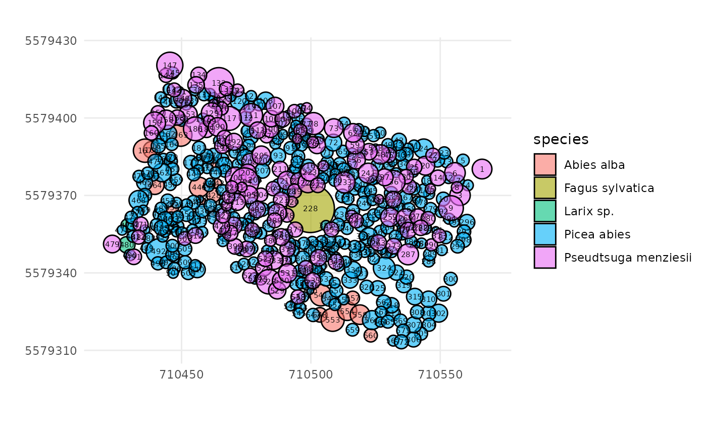
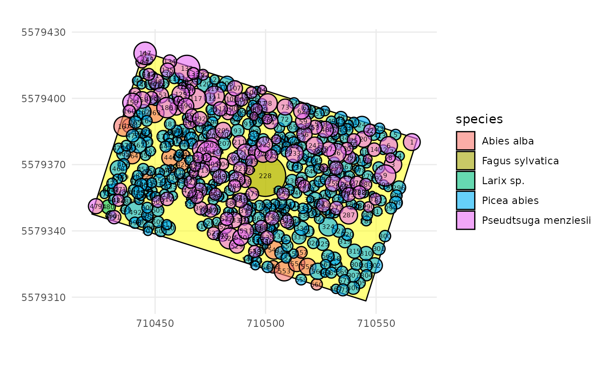
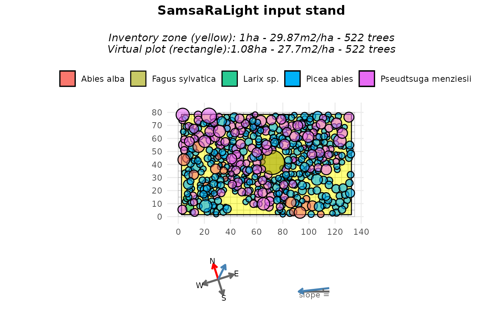
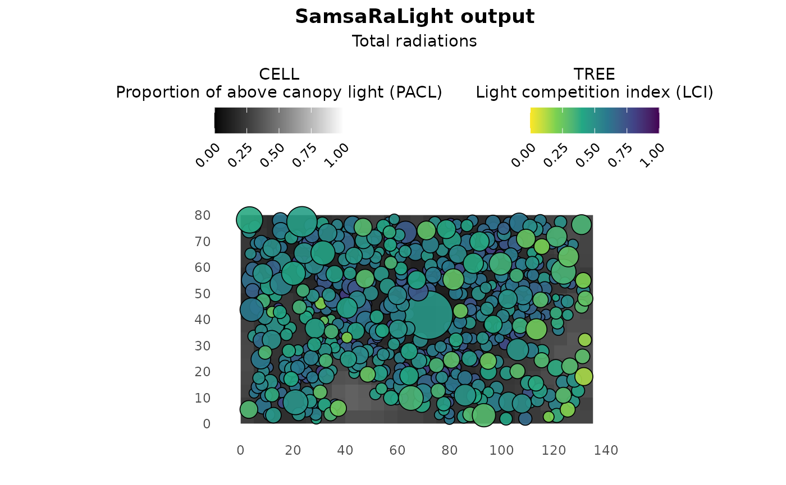

# Non-axis-aligned rectangle stand from GPS data

``` r
library(SamsaRaLight)
library(dplyr)
#> 
#> Attaching package: 'dplyr'
#> The following objects are masked from 'package:stats':
#> 
#>     filter, lag
#> The following objects are masked from 'package:base':
#> 
#>     intersect, setdiff, setequal, union
```

## Introduction

In previous tutorials, inventories were assumed to be defined directly
in a local Cartesian coordinate system (meters). In practice, however,
forest inventories are often collected with GPS data.

In this vignette, we how to convert an **inventory based on GPS
coordinates** where tree positions are given as longitude and latitude.
We will convert the geographic coordinates into planar and axis-align
the inventory zone with the virtual plot axes.

## Context and data

We first use the example inventory **IRRES1**, stored in the package as
[`SamsaRaLight::data_IRRES1`](https://natheob.github.io/SamsaRaLight/reference/SamsaRaLight_data.md).
This inventory was collected in Belgian Ardennes by Gauthier Ligot in
the scope of the IRRES project, which investigates the transition from
even-aged to uneven-aged forest management. The stand is dense in a
sloppy terrain and is mainly composed of Norway spruce and Douglas-fir,
with a coppice stool of beech at its center and a few silver fir and
larch trees.

``` r
trees_irres <- SamsaRaLight::data_IRRES1$trees

str(trees_irres)
#> 'data.frame':    522 obs. of  14 variables:
#>  $ id_tree   : int  1 3 4 5 6 7 8 9 10 12 ...
#>  $ species   : chr  "Pseudtsuga menziesii" "Pseudtsuga menziesii" "Picea abies" "Picea abies" ...
#>  $ dbh_cm    : num  36.5 37.3 18.7 27 31 22 17.7 33.9 33.5 21.7 ...
#>  $ crown_type: chr  "P" "P" "P" "P" ...
#>  $ h_m       : num  28.2 31.2 19.5 23.4 30.9 ...
#>  $ hbase_m   : num  10.42 14.44 9.99 11.38 13.04 ...
#>  $ hmax_m    : logi  NA NA NA NA NA NA ...
#>  $ rn_m      : num  3.8 3.94 2.09 2.39 3.97 2.21 2.18 4.78 2.62 2.16 ...
#>  $ rs_m      : num  3.8 3.94 2.09 2.39 3.97 2.21 2.18 4.78 2.62 2.16 ...
#>  $ re_m      : num  3.8 3.94 2.09 2.39 3.97 2.21 2.18 4.78 2.62 2.16 ...
#>  $ rw_m      : num  3.8 3.94 2.09 2.39 3.97 2.21 2.18 4.78 2.62 2.16 ...
#>  $ crown_lad : num  0.5 0.5 0.5 0.5 0.5 0.5 0.5 0.5 0.5 0.5 ...
#>  $ lon       : num  5.96 5.96 5.96 5.96 5.96 ...
#>  $ lat       : num  50.3 50.3 50.3 50.3 50.3 ...
```

Running
[`check_inventory()`](https://natheob.github.io/SamsaRaLight/reference/check_inventory.md)
on this dataset immediately fails, with an error indicating that columns
`x` and `y` are missing. This is expected: tree positions are provided
as longitude (`lon`) and latitude (`lat`), expressed in degrees. To
illustrate why this is problematic, we (incorrectly) rename longitude
and latitude to `x` and `y` and attempt to plot the inventory. It leads
to a meaningless plot as angular coordinates (degrees) are incompatible
with crown dimensions expressed in meters.

``` r
SamsaRaLight::plot_inventory(
  trees_irres %>% rename(x = lon, y = lat)
)
```


## Convert the coordinates

Before creating a stand, coordinates must be converted into a planar
Cartesian system with metric units. Tree coordinates can be converted
from the global WGS84 reference system (EPSG:4326) to a projected
coordinate system expressed in meters such as the Universal Transverse
Mercator (UTM) system. It is a grid-based, metric coordinate system
mapping the Earth using 60 longitudinal zones (each of them being
6-degree between 80°S and 84°N latitude), for each of the two
hemispheres North and South.

The EPSG needed to convert coordinates depends on the plot coordinates.
However, the UTM zone can be automatically inferred from the mean
longitude ($zone = floor\left( (lon + 180)/6 \right) + 1$ and hemisphere
inferred from the mean latitude ($hemisphere = 32600$ if latitude is
positive or $hemisphere = 32700$ if latitude is negative). Thus, EPSG
code can be automatically computed as $EPSG = hemisphere + zone$. The
function
[`SamsaRaLight::create_xy_from_lonlat()`](https://natheob.github.io/SamsaRaLight/reference/create_xy_from_lonlat.md)
allows to automatically convert a data.frame containing lon/lat
coordinates into planar XY coordinates determining the appropriate UTM
system.

``` r
trees_irres_xy <- SamsaRaLight::create_xy_from_lonlat(trees_irres)

str(trees_irres_xy)
#> List of 2
#>  $ df  :'data.frame':    522 obs. of  16 variables:
#>   ..$ id_tree   : int [1:522] 1 3 4 5 6 7 8 9 10 12 ...
#>   ..$ species   : chr [1:522] "Pseudtsuga menziesii" "Pseudtsuga menziesii" "Picea abies" "Picea abies" ...
#>   ..$ dbh_cm    : num [1:522] 36.5 37.3 18.7 27 31 22 17.7 33.9 33.5 21.7 ...
#>   ..$ crown_type: chr [1:522] "P" "P" "P" "P" ...
#>   ..$ h_m       : num [1:522] 28.2 31.2 19.5 23.4 30.9 ...
#>   ..$ hbase_m   : num [1:522] 10.42 14.44 9.99 11.38 13.04 ...
#>   ..$ hmax_m    : logi [1:522] NA NA NA NA NA NA ...
#>   ..$ rn_m      : num [1:522] 3.8 3.94 2.09 2.39 3.97 2.21 2.18 4.78 2.62 2.16 ...
#>   ..$ rs_m      : num [1:522] 3.8 3.94 2.09 2.39 3.97 2.21 2.18 4.78 2.62 2.16 ...
#>   ..$ re_m      : num [1:522] 3.8 3.94 2.09 2.39 3.97 2.21 2.18 4.78 2.62 2.16 ...
#>   ..$ rw_m      : num [1:522] 3.8 3.94 2.09 2.39 3.97 2.21 2.18 4.78 2.62 2.16 ...
#>   ..$ crown_lad : num [1:522] 0.5 0.5 0.5 0.5 0.5 0.5 0.5 0.5 0.5 0.5 ...
#>   ..$ lon       : num [1:522] 5.96 5.96 5.96 5.96 5.96 ...
#>   ..$ lat       : num [1:522] 50.3 50.3 50.3 50.3 50.3 ...
#>   ..$ x         : num [1:522] 710566 710558 710561 710559 710556 ...
#>   ..$ y         : num [1:522] 5579380 5579370 5579374 5579384 5579379 ...
#>  $ epsg: num 32631
```

After this conversion, tree positions are expressed in meters and the
inventory can now be validated and visualized correctly.

``` r
SamsaRaLight::check_inventory(trees_irres_xy$df)
#> Inventory table successfully validated.
plot_inventory(trees_irres_xy$df)
```



## Define the inventory zone

In the IRRES1 example dataset, the trees were inventoried within a
rectangular inventory zone. However, the vertices are also expressed in
a lon/lat coordinate system and therefore need to be converted.

``` r
polygon_irres_xy <- SamsaRaLight::create_xy_from_lonlat(
  SamsaRaLight::data_IRRES1$core_polygon
)

str(polygon_irres_xy)
#> List of 2
#>  $ df  :'data.frame':    4 obs. of  4 variables:
#>   ..$ lon: num [1:4] 5.96 5.96 5.96 5.96
#>   ..$ lat: num [1:4] 50.3 50.3 50.3 50.3
#>   ..$ x  : num [1:4] 710569 710545 710421 710445
#>   ..$ y  : num [1:4] 5579382 5579308 5579348 5579421
#>  $ epsg: num 32631
```

We can verify that the trees and the inventory polygon are both
expressed in metres within the same coordinate system. To do so, we can
use the same
[`plot_inventory()`](https://natheob.github.io/SamsaRaLight/reference/plot_inventory.md)
function as above but adding the core polygon data.frame as a second
argument.

``` r
SamsaRaLight::plot_inventory(
  trees_irres_xy$df,
  polygon_irres_xy$df
)
```



We can use the function
[`SamsaRaLight::check_polygon()`](https://natheob.github.io/SamsaRaLight/reference/check_polygon.md)
to check that the core polygon is geometrically correct and encompasses
all the inventoried trees. If it does not, the function tries to correct
it by making minimal changes, such as converting the polygon into a
valid one (e.g. if the vertices are not in the correct order) or adding
a small buffer to the polygon in an attempt to include all the trees
(e.g. if some trees are close to the border, small rounding errors can
lead to the polygon excluding them computationally). Thus, the function
returns the minimally corrected polygon and specifies this with a
message if the polygon has been modified; otherwise, it throws an error.

``` r
polygon_irres_xy$df <- SamsaRaLight::check_polygon(
  polygon_irres_xy$df,
  trees_irres_xy$df
)
#> Polygon successfully validated.
```

## Create the virtual stand

Fortunately, the SamsaRaLight package allows you to provide both tree
inventory and core polygon tables with only longitude/latitude
coordinates to the
[`create_sl_stand()`](https://natheob.github.io/SamsaRaLight/reference/create_sl_stand.md)
function, which automatically performs system conversions. The stand
creation process will also handle coordinate shifts into a relative
coordinate system starting at 0.

Because the projected coordinates follow a conventional GIS orientation
(Y axis pointing North), we set `north2x = 90`, meaning that geographic
North corresponds to the positive Y direction.

``` r
stand_irres <- SamsaRaLight::create_sl_stand(
  trees_inv = SamsaRaLight::data_IRRES1$trees,
  cell_size = 5,
  
  latitude = SamsaRaLight::data_IRRES1$info$latitude,
  slope    = SamsaRaLight::data_IRRES1$info$slope,
  aspect  = SamsaRaLight::data_IRRES1$info$aspect,
  north2x = 90,
  
  core_polygon_df = SamsaRaLight::data_IRRES1$core_polygon
)
#> `trees_inv` converted from lon/lat to planar coordinates (UTM).
#> `core_polygon_df` converted from lon/lat to planar coordinates (UTM).
#> SamsaRaLight stand successfully created.

plot(stand_irres)
```


The stand dimensions are chosen as the **smallest grid (in number of
cells)** that fully contains the inventory zone:

``` r
stand_irres$geometry$n_cells_x
#> [1] 30
stand_irres$geometry$n_cells_y
#> [1] 23
```

This corresponds to a stand size of:

``` r
stand_irres$geometry$n_cells_x * stand_irres$geometry$cell_size
#> [1] 150
stand_irres$geometry$n_cells_y * stand_irres$geometry$cell_size
#> [1] 115
```

Then, tree coordinates are shifted to a local coordinate system starting
at zero:

``` r
stand_irres$transform$shift_x
#> [1] -710420
stand_irres$transform$shift_y
#> [1] -5579307
```

## Set the axis-aligned rectangle option

At this stage, the inventory is not yet axis-aligned. This is not a
technical issue with this package, and the light computation can be run
using the virtual non-axis-aligned stand created above. However, as can
be seen in the above plot, the area surrounding the rectangular
inventory zone is empty, which could affect light interception.
Therefore, in most cases, it is preferable to work with a rectangle
aligned with the simulation axes. To do so, we have to recreate the
virtual stand by setting `modify_polygon = "aarect"` (for axis-aligned
rectangle), which:

1.  **compute the minimum bounding rectangle of the inventory polygon**
    (in this case, as our inventory zone is already a rectangle, it does
    not change anything),
2.  **rotate the entire stand (trees and polygon)** so that this
    rectangle becomes axis-aligned (the rotation counter-clockwise in
    degrees applied to the stand is stored internally in
    `transform$rotation_ccw$`)
3.  **update the `north2x` value accordingly** (and can be seen in the
    compass of the
    [`plot()`](https://rdrr.io/r/graphics/plot.default.html) function)

``` r
stand_irres_aarect <- SamsaRaLight::create_sl_stand(
  trees_inv = SamsaRaLight::data_IRRES1$trees,
  cell_size = 5,
  
  latitude = SamsaRaLight::data_IRRES1$info$latitude,
  slope    = SamsaRaLight::data_IRRES1$info$slope,
  aspect  = SamsaRaLight::data_IRRES1$info$aspect,
  north2x = 90,
  
  core_polygon_df = SamsaRaLight::data_IRRES1$core_polygon,
  modify_polygon = "aarect"
)
#> `trees_inv` converted from lon/lat to planar coordinates (UTM).
#> `core_polygon_df` converted from lon/lat to planar coordinates (UTM).
#> SamsaRaLight stand successfully created.

plot(stand_irres_aarect)
```



As we can see, rotating the stand results in a rectangular inventory
zone (shown in yellow) that may not cover the entire virtual stand area.
This creates empty spaces around the borders of the virtual stand and
reduces the total basal area per hectare (due to a larger area with the
same number of trees). This could slightly bias the light computation,
even though the small empty areas on the borders could be negligible for
tree light interception. This can also be avoided by:

1.  Setting the cell size to a smaller value to reduce the empty space,
    which would result in much higher computation time.
2.  Alternatively, the rectangle could be set up without being
    axis-aligned and the ‘fill_around’ argument could be used. This will
    be explained in the second and third examples of this tutorial and
    involves filling around the inventory zone with virtual trees, but
    introduces stochasticity to the stand virtualisation.

## Run SamsaraLight

As shown in the previous tutorials, monthly radiation data are retrieved
using the geographic location of the stand.

``` r
data_radiations_irres <- SamsaRaLight::get_monthly_radiations(
  latitude  = SamsaRaLight::data_IRRES1$info$latitude,
  longitude = SamsaRaLight::data_IRRES1$info$longitude
)
```

And the simulation is run using
[`run_sl()`](https://natheob.github.io/SamsaRaLight/reference/run_sl.md)
(here run with the axis-aligned inventory zone).

``` r
output_irres_aarect <- SamsaRaLight::run_sl(
  sl_stand = stand_irres_aarect,
  monthly_radiations = data_radiations_irres
)
#> parallel mode disabled because OpenMP was not available
#> SamsaRaLight simulation was run successfully.

plot(output_irres_aarect)
```


