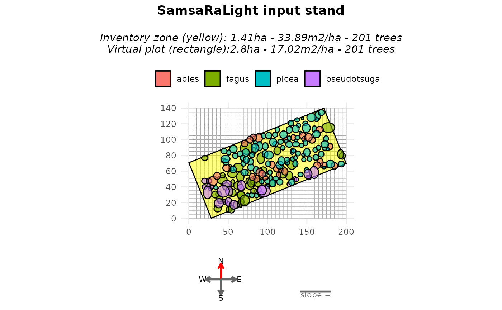
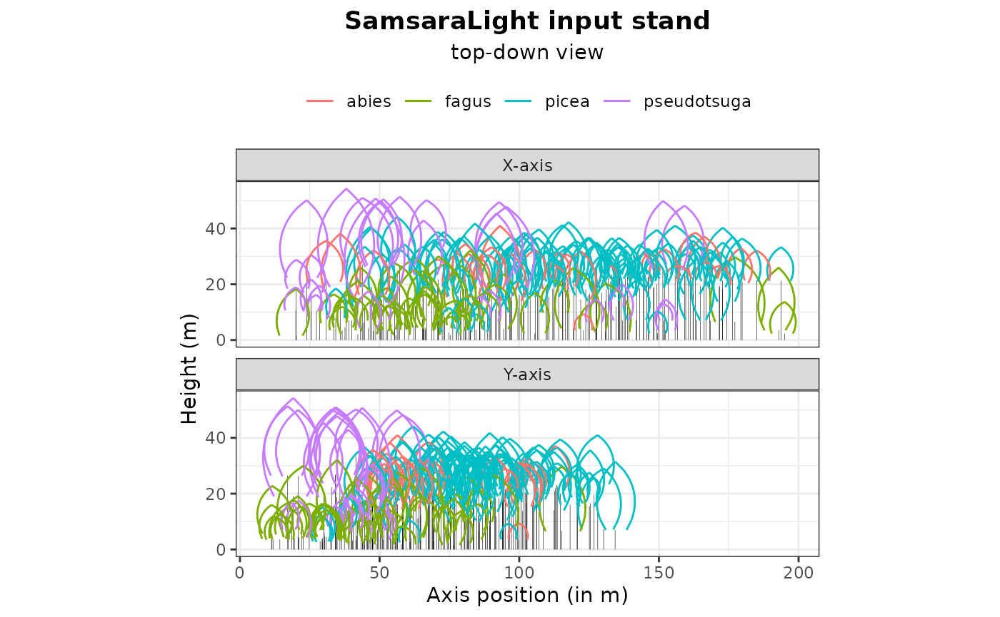
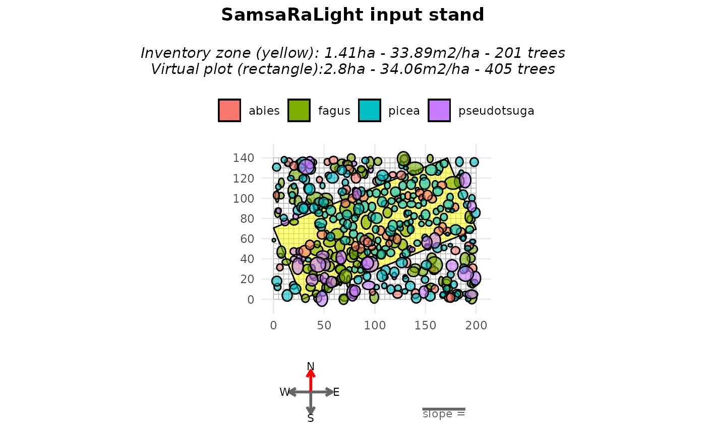
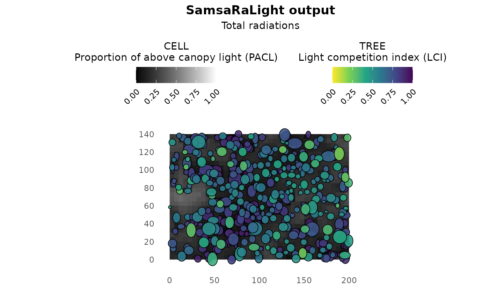

# Asymmetric crowns in a non-axis-aligned stand

``` r

library(SamsaRaLight)
library(dplyr)
#> 
#> Attaching package: 'dplyr'
#> The following objects are masked from 'package:stats':
#> 
#>     filter, lag
#> The following objects are masked from 'package:base':
#> 
#>     intersect, setdiff, setequal, union
```

## Introduction

In previous tutorials, tree crowns were represented using simple
symmetric shapes (“E” and “P”). However, real tree crowns are often
asymmetric, both horizontally (different crown radii in different
directions) and vertically (maximum crown width not located at mid-crown
for “E” nor crown base height for “P”).

In this vignette, we will use an **inventory with asymmetric crown
shapes**. We will work with a non axis-aligned rectangle inventory zone
to show that rotating a stand where crown are represented as assymetric
shapes is tricky.

## Crown shapes available in SamsaRaLight

SamsaRaLight supports the following crown types:
`"E", "P", "2E", "4P", "8E"`. The number indicates how many crown parts
are used. The letter indicates the geometric shape (Ellipsoid or
Paraboloid). Choose the simplest crown type that matches your data
quality.

### Symmetric crown shapes

Symetric shapes used in the Tutorial 1, defined by the mean crown radius
(mean of the four radius `rn_m`, `rs_m`, `re_m` and `rw_m`) and the
crown depth (computed as `h_m - hbase_m`. These shapes are simple and
efficient, but cannot represent crown asymmetry, knowing that crown
asymmetry strongly affects light interception.

#### *“E” — Symmetric ellipsoid*

- Single ellipsoidal volume

- Same radius in all directions

- Maximum radius automatically computed at mid-crown height
  (`hmax_m = hbase_m + (h_m - hbase_m) / 2`

#### *“P” — Symmetric paraboloid*

- Single paraboloid volume

- Same radius in all directions

- Maximum radius located at crown base height (`hmax_m = base_m`)

### Asymmetric crown shapes

More complex shapes are created by splitting the crown into multiple
geometric parts.

#### *“2E” — Vertical asymmetry*

- Crown split into an upper and a lower ellipsoid

- Allows vertical asymmetry

- Requires `hmax_m`, the height of maximum crown radius

Crown remains horizontally symmetric. Use this shape when crown
expansion is not centered vertically.

#### *“4P” — Horizontal asymmetry*

- Crown split into four horizontal paraboloids

- Different radii allowed in the four cardinal directions: `rn_m`
  (north), `rs_m` (south), `re_m` (east) and `rw_m` (west)

- Crown is vertically symmetric: `hmax_m` is NOT required (paraboloid,
  thus `hmax = hbase_m`)

Use this shape when crowns are laterally deformed by competition.

#### *“8E” — Full asymmetry*

- Crown split into upper and lower parts (vertical asymmetry)

- each split into four cardinal directions (horizontal asymmetry)

- Requires: `rn_m`, `rs_m`, `re_m`, `rw_m` and `hmax_m`

This is the most detailed crown representation available.

## Context and data

We illustrate asymmetric crowns using the **Bechefa** marteloscope,
stored in the package as
[`SamsaRaLight::data_bechefa`](https://natheob.github.io/SamsaRaLight/reference/SamsaRaLight_data.md).

This marteloscope was installed in Belgian Ardennes by Gauthier Ligot in
the scope of the IRRES project, which investigates the transition from
even-aged to uneven-aged forest management. This is a mature mixed stand
of Douglas fir and spruce in the Belgian Ardennes. The stand has been
uneven-aged for more than 10 years.

All trees use the `"8E"` crown type, allowing both horizontal and
vertical asymmetry. Each tree provides four directional crown radii
(`rn_m` for maximum crown radius pointing north, `rs_m` for south,
`re_m` for east, `rw_m` for west) and the height of maximum crown
expansion (`hmax_m`).

``` r

head(SamsaRaLight::data_bechefa$trees)
#>   id_tree     species     x    y    dbh_cm crown_type  h_m hbase_m hmax_m rn_m
#> 1     103       abies 163.1 67.3  68.43663         8E 38.5    16.6   28.2 4.32
#> 2     615 pseudotsuga  66.8 41.4  95.49297         8E 50.2    14.0   33.3 7.01
#> 3     102 pseudotsuga 159.2 58.2 111.72677         8E 48.2    10.8   27.1 8.38
#> 4     708 pseudotsuga  43.8 34.2 116.81973         8E 51.0    15.8   27.0 7.37
#> 5     707 pseudotsuga  51.4 34.1  99.94930         8E 50.5    16.0   26.7 6.73
#> 6     712 pseudotsuga  57.2 17.0 112.04508         8E 51.4    14.4   26.5 5.02
#>   rs_m re_m rw_m crown_lad
#> 1 4.12 3.70 5.20       0.6
#> 2 6.45 5.87 4.15       0.6
#> 3 6.72 4.69 6.51       0.6
#> 4 7.43 9.85 5.44       0.6
#> 5 5.16 3.40 5.76       0.6
#> 6 6.02 5.00 5.32       0.6
```

## Create the stand

The subsequent steps are identical to those used with symmetric crowns
(see Tutorial 1). Introducing asymmetric crowns only requires adapting
the initial tree inventory. Horizontal asymmetry is clearly visible in
the plots, whereas vertical asymmetry is more difficult to perceive
graphically because crowns are displayed as projected shapes.

It is important to note that the `north2x` parameter must be a multiple
of 90° (i.e. 0°, 90°, 180°, or 270°) when the virtual stand contains at
least one horizontally asymmetric crown type (i.e. `"4P"` or `"8E"`).
Horizontal asymmetry is defined by assigning different crown radii to
the four cardinal directions (north, south, east, and west). These four
directional radii are internally converted into planar X–Y axis-aligned
radii according to the value of `north2x`.

``` r

stand_bechefa <- SamsaRaLight::create_sl_stand(
  trees_inv = SamsaRaLight::data_bechefa$trees,
  
  cell_size = 5,
  
  latitude = SamsaRaLight::data_bechefa$info$latitude,
  slope = SamsaRaLight::data_bechefa$info$slope,
  aspect = SamsaRaLight::data_bechefa$info$aspect,
  north2x = SamsaRaLight::data_bechefa$info$north2x,
  
  core_polygon_df = SamsaRaLight::data_bechefa$core_polygon
)
#> SamsaRaLight stand successfully created.

plot(stand_bechefa)
```



``` r

plot(stand_bechefa, top_down = TRUE)
```



## Fill around the inventory zone

Such as in the previous tutorial, we may want to rotate the stand in
order to axis-align it. However, because of the same reason as the
described above for `north2x` when considering at least one horizontal
asymmetric crown, we can rotate the stand only by a multiple of 90°,
leading to impossibility to axis-align the stand in most case. For this
reason, the argument “modify_polygon = aarect” is desactivated if at
least one horizontal asymmetric crown is present in the stand. However,
the user can still transform and ensure its inventory zone is a perfect
rectangle (minimum enclosing rectangle area) with the argument
`modify_polygon = "rect"`. Otherwise, to not modify the given polygon,
the default argument is `modify_polygon = "none"`.

To counteract the fact that plot is empty around the non-axis aligned
rectangle inventory zone, we can use the argument `fill_around = TRUE`
when creating the vitual stand with the
[`create_sl_stand()`](https://natheob.github.io/SamsaRaLight/reference/create_sl_stand.md).
This will add **virtual trees outside the inventory polygon, within the
simulation grid**:

- sampled from the inventoried trees,

- randomly positioned outside the inventory zone,

- until the surrounding area reaches the **same basal area per hectare**
  as the inventory zone.

``` r

stand_bechefa_filled <- SamsaRaLight::create_sl_stand(
  trees_inv = SamsaRaLight::data_bechefa$trees,
  
  cell_size = 5,
  
  latitude = SamsaRaLight::data_bechefa$info$latitude,
  slope = SamsaRaLight::data_bechefa$info$slope,
  aspect = SamsaRaLight::data_bechefa$info$aspect,
  north2x = SamsaRaLight::data_bechefa$info$north2x,
  
  core_polygon_df = SamsaRaLight::data_bechefa$core_polygon,
  modify_polygon = "rect",
  fill_around = TRUE
)
#> SamsaRaLight stand successfully created.

plot(stand_bechefa_filled)
```



When plotting, the argument `only_inv = TRUE` allows displaying only the
inventoried trees (inside the yellow polygon). Added trees are
identified in the stand object using the logical column `added_to_fill`.

``` r

table(stand_bechefa_filled$trees$added_to_fill)
#> 
#> FALSE  TRUE 
#>   201   204
```

A summary of both the inventory zone and the full virtual stand can be
obtained with the [`summary()`](https://rdrr.io/r/base/summary.html)
function, showing that both zones exhibit similar basal area per hectare
and mean quadratic diameter.

``` r

summary(stand_bechefa_filled)
#> 
#> SamsaRaLight stand summary
#> ================================
#> 
#> 
#> Inventory (core polygon):
#>   Area              : 1.41 ha
#>   Trees             : 201
#>   Density           : 142.9 trees/ha
#>   Basal area        : 33.89 m2/ha
#>   Quadratic mean DBH: 54.9 cm
#> 
#> Simulation stand (core + filled buffer):
#>   Area              : 2.80 ha
#>   Trees             : 405
#>   Density           : 144.6 trees/ha
#>   Basal area        : 34.06 m2/ha
#>   Quadratic mean DBH: 54.8 cm
#> 
#> Stand geometry:
#>   Grid              : 40 x 28 (1120 cells)
#>   Cell size         : 5.00 m
#>   Slope             : 0.00 deg
#>   Aspect            : 0.00 deg
#>   North to X-axis   : 90.00 deg
#> 
#> Number of sensors: 0
```

This approach assumes that the surrounding stand is structurally similar
to the inventoried area. As mentionned above, this add stochasticity in
the stand virtualisation, thus to be considered with care and maybe with
duplicates for rigorous scientific studies for example.

## Run SamsaraLight

``` r

radiations_bechefa <- SamsaRaLight::get_monthly_radiations(
  latitude = SamsaRaLight::data_bechefa$info$latitude,
  longitude = SamsaRaLight::data_bechefa$info$longitude)

output_bechefa <- SamsaRaLight::run_sl(
  sl_stand = stand_bechefa_filled,
  monthly_radiations = radiations_bechefa
)
#> parallel mode disabled because OpenMP was not available
#> SamsaRaLight simulation was run successfully.

plot(output_bechefa)
```


