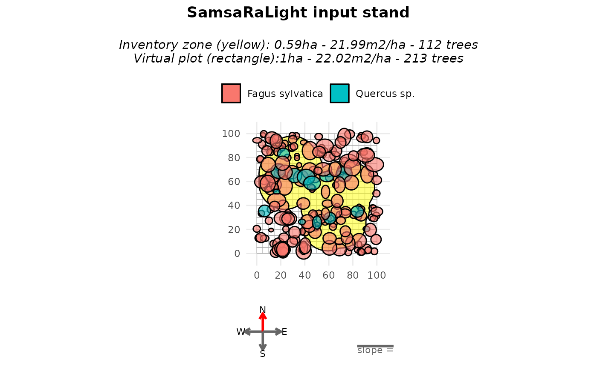
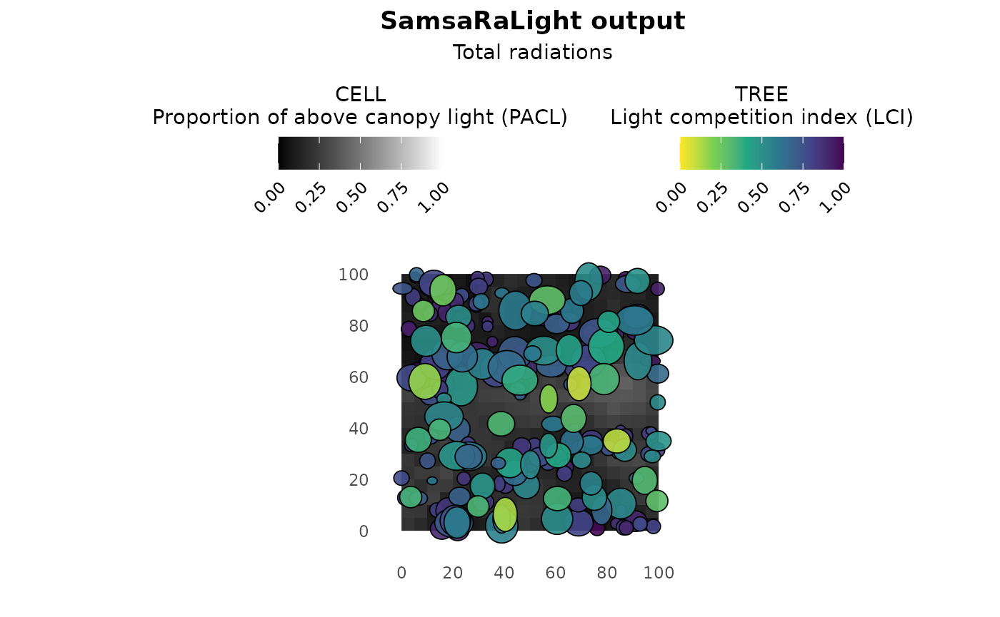

# Non-rectangular inventory zone

``` r
library(SamsaRaLight)
library(dplyr)
#> 
#> Attaching package: 'dplyr'
#> The following objects are masked from 'package:stats':
#> 
#>     filter, lag
#> The following objects are masked from 'package:base':
#> 
#>     intersect, setdiff, setequal, union
```

## Introduction

In previous tutorials, inventories were assumed to be simple,
axis-aligned rectangles. In practice, however, forest inventories are
often more complex, and may not be necessary rectangle depending on the
inventory protocol.

In this vignette, we illustrate the case of an **non-rectangular
inventory**. The sampled area is defined by an irregular polygon (*e.g.*
a combination of circular plots), filled around by virtual trees.

## Context and data

We now consider the example inventory **Cloture20**, stored in the
package as
[`SamsaRaLight::data_cloture20`](https://natheob.github.io/SamsaRaLight/reference/SamsaRaLight_data.md).

This inventory was collected by Gauthier Ligot in Wallonia, Belgium, as
part of the CLOTURE project, which investigates the effect of fences on
beech and oak plots with varying beech proportions. In this case, the
plot is primarily made up of beech trees (Fagus sylvatica). The crowns
are described with full asymmetric shapes “8E”. The inventory protocol
is complex and resulted in non-rectangular inventory zones formed from
multiple circular areas. Thus, the core polygon is defined by 94
vertices:

``` r
str(SamsaRaLight::data_cloture20$core_polygon)
#> 'data.frame':    94 obs. of  2 variables:
#>  $ x: num  54 56.4 59.1 61.9 64.8 ...
#>  $ y: num  70.4 72.2 73.6 74.6 75.2 ...
```

## Virtual stand with complex core polygon

First, we can create the virtual stand by setting the pre-defined core
polygon stored in the package. Representing the inventory as a rectangle
in this case would be inconsistent with the field protocol. Therefore,
the polygon is preserved inside a larger virtual stand with
`modify_polygon = "none"` and the virtual stand is filled around the
inventory zone with `fill_around = TRUE`.

``` r
stand_cloture_filled <- SamsaRaLight::create_sl_stand(
  trees_inv = SamsaRaLight::data_cloture20$trees,
  cell_size = 5,
  
  latitude = SamsaRaLight::data_cloture20$info$latitude,
  slope    = SamsaRaLight::data_cloture20$info$slope,
  aspect  = SamsaRaLight::data_cloture20$info$aspect,
  north2x = SamsaRaLight::data_cloture20$info$north2x,
  
  core_polygon_df = SamsaRaLight::data_cloture20$core_polygon,
  modify_polygon = "none",
  fill_around = TRUE
)
#> SamsaRaLight stand successfully created.
```

``` r
plot(stand_cloture_filled)
```



``` r
summary(stand_cloture_filled)
#> 
#> SamsaRaLight stand summary
#> ================================
#> 
#> 
#> Inventory (core polygon):
#>   Area              : 0.59 ha
#>   Trees             : 112
#>   Density           : 190.5 trees/ha
#>   Basal area        : 21.99 m2/ha
#>   Quadratic mean DBH: 38.3 cm
#> 
#> Simulation stand (core + filled buffer):
#>   Area              : 1.00 ha
#>   Trees             : 213
#>   Density           : 213.0 trees/ha
#>   Basal area        : 22.02 m2/ha
#>   Quadratic mean DBH: 36.3 cm
#> 
#> Stand geometry:
#>   Grid              : 20 x 20 (400 cells)
#>   Cell size         : 5.00 m
#>   Slope             : 0.00 deg
#>   Aspect            : 0.00 deg
#>   North to X-axis   : 90.00 deg
#> 
#> Number of sensors: 0
```

## Run SamsaraLight

Finally, the radiation data and the simulation run are done as usual:

``` r
data_radiations_cloture <- SamsaRaLight::get_monthly_radiations(
  latitude  = SamsaRaLight::data_cloture20$info$latitude,
  longitude = SamsaRaLight::data_cloture20$info$longitude
)

output_cloture_filled <- SamsaRaLight::run_sl(
  sl_stand = stand_cloture_filled,
  monthly_radiations = data_radiations_cloture
)
#> parallel mode disabled because OpenMP was not available
#> SamsaRaLight simulation was run successfully.
```

``` r
plot(output_cloture_filled)
```



``` r
summary(output_cloture_filled)
#> 
#> SamsaRaLight simulation summary
#> ================================
#> 
#> Trees (crown interception)
#> ---------------------------
#>       epot               e                 lci        
#>  Min.   :  30904   Min.   :   694.8   Min.   :0.0906  
#>  1st Qu.: 139463   1st Qu.: 14399.6   1st Qu.:0.5837  
#>  Median : 244016   Median : 43603.7   Median :0.7845  
#>  Mean   : 391760   Mean   :148149.6   Mean   :0.7233  
#>  3rd Qu.: 617430   3rd Qu.:273832.3   3rd Qu.:0.8966  
#>  Max.   :1319122   Max.   :815029.7   Max.   :0.9899  
#> 
#> Cells (ground light)
#> -------------------
#>        e                pacl             punobs      
#>  Min.   :  91.59   Min.   :0.02434   Min.   :0.0000  
#>  1st Qu.: 356.87   1st Qu.:0.09485   1st Qu.:0.5240  
#>  Median : 566.30   Median :0.15051   Median :0.6896  
#>  Mean   : 606.90   Mean   :0.16130   Mean   :0.6293  
#>  3rd Qu.: 843.78   3rd Qu.:0.22426   3rd Qu.:0.7710  
#>  Max.   :1532.63   Max.   :0.40734   Max.   :0.8858  
#> 
#> Sensors
#> -------
#> No sensor energy variables available
```
