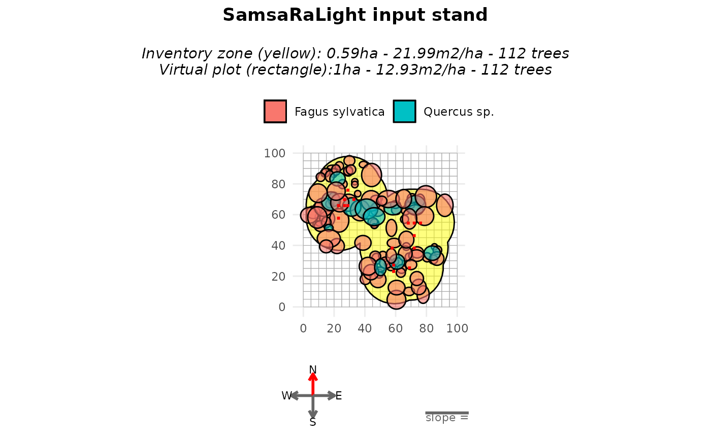
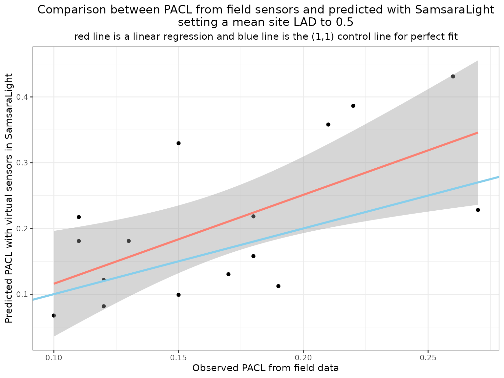

# Implement virtual sensors

``` r
library(SamsaRaLight)
library(dplyr)
library(ggplot2)
library(grid)
```

## Introduction

Virtual sensors allow us to estimate the amount of radiation reaching
specific locations in the stand, such as the forest floor. In this
vignette, we show how to define and use virtual sensors in SamsaRaLight,
and how sensor outputs can be compared with field measurements of
percentage of above canopy light (PACL).

## Measuring light in the field

In forest ecosystems, light availability at the ground level can be
measured using direct sensors (quantum sensors, dataloggers) or indirect
methods such as hemispherical photography. These measurements provide
estimates of transmitted radiation or PACL at specific locations. In
SamsaRaLight, virtual sensors are designed to reproduce such
measurements within simulated stands.

## Defining sensors in a virtual stand

In the model, a sensor represents a point where incoming radiation is
recorded. Sensors are defined by their spatial coordinates and height
over the ground and are provided as a dedicated data.frame when creating
the stand. Measurements of PACL are not required as input data for the
model, only `id_sensor`, `x`, `y` and `h_m` variables.

The following example shows the sensor configuration used in the
`cloture20` dataset.

``` r
SamsaRaLight::data_cloture20$sensors
#>    id_sensor     x     y h_m pacl pacl_direct pacl_diffuse
#> 1          1 22.00 56.64   2 0.11        0.13         0.10
#> 2          2 71.22 53.45   3 0.22        0.28         0.16
#> 3          3 75.30 53.45   3 0.26        0.31         0.21
#> 4          4 71.22 45.27   3 0.15        0.13         0.16
#> 5          5 71.22 37.21   3 0.13        0.08         0.17
#> 6          6 56.88 37.21   3 0.18        0.12         0.22
#> 7          7 68.11 24.30   2 0.27        0.29         0.24
#> 8          8 57.84 22.00   3 0.18        0.21         0.15
#> 9          9 57.84 26.11   3 0.10        0.12         0.09
#> 10        10 67.34 53.45   3 0.21        0.26         0.17
#> 11        11 22.00 64.82   3 0.17        0.20         0.15
#> 12        12 25.97 64.82   3 0.19        0.24         0.15
#> 13        13 25.97 68.74   3 0.12        0.09         0.14
#> 14        14 28.08 74.86   3 0.11        0.03         0.18
#> 15        15 32.00 68.74   3 0.12        0.07         0.17
#> 16        16 28.08 64.82   3 0.15        0.18         0.13
```

An input sensors data.frame structure can be checked using the function
[`SamsaRaLight::check_sensors()`](https://natheob.github.io/SamsaRaLight/reference/check_sensors.md)

``` r
SamsaRaLight::check_sensors(SamsaRaLight::data_cloture20$sensors)
#> Sensors table successfully validated.
```

Sensors are included in the stand definition using the `sensors`
argument of
[`create_sl_stand()`](https://natheob.github.io/SamsaRaLight/reference/create_sl_stand.md).

``` r
stand_cloture <- SamsaRaLight::create_sl_stand(
  
  # Tree inventory
  trees_inv = SamsaRaLight::data_cloture20$trees,
  core_polygon_df = SamsaRaLight::data_cloture20$core_polygon,
  
  # STand geometry
  cell_size = 5,
  latitude = SamsaRaLight::data_cloture20$info$latitude,
  slope = SamsaRaLight::data_cloture20$info$slope,
  aspect = SamsaRaLight::data_cloture20$info$aspect,
  north2x = SamsaRaLight::data_cloture20$info$north2x,
  
  # Define sensors
  sensors = SamsaRaLight::data_cloture20$sensors
) 
#> SamsaRaLight stand successfully created.
```

Once the stand is created, their presence can be checked by printing or
plotting the object. Sensors appear as red symbols in the graphical
outputs and can be hidden if needed (`add_sensors = F` argument).

``` r
print(stand_cloture)
#> SamsaRaLight stand of 1 ha with 112 trees and 16 sensors (20 x 20 cells, 5 m)

plot(stand_cloture)
```



``` r
plot(stand_cloture, top_down = TRUE)
```


## Obtaining sensor outputs

After defining the sensors, the model is run in the usual way. When only
sensor outputs are required, the argument `sensors_only = TRUE` can be
used to reduce computation time. In this example, we compute the full
output for illustration purposes.

``` r
out_cloture <- SamsaRaLight::run_sl(
  sl_stand = stand_cloture,
  monthly_radiations = SamsaRaLight::data_cloture20$radiations,
  
  detailed_output = TRUE,
  sensors_only = FALSE
)
#> parallel mode disabled because OpenMP was not available
#> SamsaRaLight simulation was run successfully.
```

Sensor-level results are stored following the same structure as cell
outputs and include total, direct, and diffuse components when
`detailed_output = TRUE`. Unlike cells, sensor energy is computed on a
horizontal plane, which makes it directly comparable with most field
measurements.

``` r
out_cloture$output$light$sensors
#>    id_sensor         e  e_direct e_diffuse       pacl pacl_direct pacl_diffuse
#> 1          1  817.4559 425.40610  392.0498 0.21726347  0.24757768   0.19178300
#> 2          2 1454.4341 716.25729  738.1768 0.38655958  0.41684714   0.36110152
#> 3          3 1622.3084 788.75348  833.5549 0.43117721  0.45903844   0.40775859
#> 4          4 1240.0123 404.74326  835.2691 0.32957054  0.23555232   0.40859712
#> 5          5  680.8260 176.53401  504.2920 0.18094998  0.10273919   0.24668969
#> 6          6  593.9706 128.45331  465.5173 0.15786554  0.07475721   0.22772186
#> 7          7  858.2436 405.83814  452.4055 0.22810404  0.23618952   0.22130782
#> 8          8  821.6580 397.79317  423.8648 0.21838030  0.23150752   0.20734629
#> 9          9  253.9889 132.70715  121.2817 0.06750518  0.07723286   0.05932862
#> 10        10 1347.1743 693.37862  653.7956 0.35805205  0.40353222   0.31982390
#> 11        11  490.3601 285.78999  204.5701 0.13032792  0.16632395   0.10007163
#> 12        12  422.3859 263.06666  159.3193 0.11226176  0.15309943   0.07793584
#> 13        13  307.0776  59.24406  247.8335 0.08161509  0.03447884   0.12123525
#> 14        14  680.3499  62.72809  617.6218 0.18082343  0.03650647   0.30212838
#> 15        15  457.6489  81.03445  376.6145 0.12163396  0.04716040   0.18423236
#> 16        16  372.5266 214.53832  157.9883 0.09901014  0.12485693   0.07728474
#>        punobs punobs_direct punobs_diffuse
#> 1  0.59504353     0.6521300      0.5331001
#> 2  0.82050838     0.8237331      0.8173794
#> 3  0.85569064     0.8616030      0.8500961
#> 4  0.78413732     0.6482008      0.8500076
#> 5  0.58082708     0.2665100      0.6908579
#> 6  0.66061987     0.2641992      0.7700069
#> 7  0.76225271     0.7478208      0.7751991
#> 8  0.70538618     0.7032524      0.7073887
#> 9  0.07753127     0.0000000      0.1623664
#> 10 0.81094145     0.8212472      0.8000118
#> 11 0.33330079     0.3169804      0.3561008
#> 12 0.35900030     0.3691445      0.3422504
#> 13 0.50439532     0.4545890      0.5163014
#> 14 0.82227653     0.5574548      0.8491729
#> 15 0.74476584     0.6549218      0.7640972
#> 16 0.34946436     0.3930375      0.2902947
```

## Comparing observed and simulated PACL

We can now compare simulated PACL values with field measurements
collected at the sensor locations. The following figure shows the
relationship between observed and predicted PACL for an initial LAD
value of 0.5. When predictions are systematically higher than
observations, the model simulates too much transmitted light. This
indicates that foliage density is underestimated and that LAD should be
increased. Conversely, systematic underestimation would suggest
excessive attenuation.

``` r
dplyr::left_join(
  
  SamsaRaLight::data_cloture20$sensors %>% 
    dplyr::select(id_sensor, pacl) %>% 
    dplyr::rename_at(vars(-"id_sensor"), ~paste0(., "_obs")),
  
  out_cloture$output$light$sensors %>% 
    dplyr::select(id_sensor, pacl) %>% 
    dplyr::rename_at(vars(-"id_sensor"), ~paste0(., "_pred")),
  
  by = "id_sensor"
) %>% 
  
  dplyr::mutate(
    diff_pacl = pacl_obs - pacl_pred
  ) %>% 
  
  ggplot(aes(y = pacl_pred, x = pacl_obs)) +
  geom_point() +
  geom_smooth(method = "lm", formula = y ~ x, color = "salmon", linewidth = 1.1) +
  geom_abline(intercept = 0, slope = 1, color = "skyblue", linewidth = 1.1) +
  xlab("Observed PACL from field data") +
  ylab("Predicted PACL with virtual sensors in SamsaraLight") +
  labs(title = "Comparison between PACL from field sensors and predicted with SamsaraLight\nsetting a mean site LAD to 0.5",
       subtitle = "red line is a linear regression and blue line is the (1,1) control line for perfect fit") +
  theme_bw() +
  theme(plot.title = element_text(hjust = 0.5),
        plot.subtitle = element_text(hjust = 0.5))
```



In this example, PACL is on average overestimated, suggesting that the
default LAD value of 0.5 is slightly too low.
