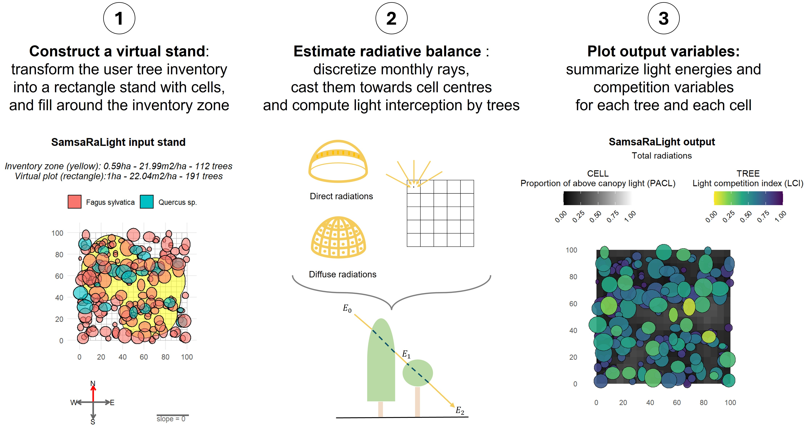

## Summary

The SamsaRaLight R package (Figure 1) has been designed to make the SamsaraLight ray-tracing model [@courbaud_simulating_2003] simpler and faster to use directly in the R programming environment. It allows users to estimate the energy absorbed by each tree in a given forest over a specified period, and consequently the energy reaching the forest floor. To achieve this, the package allows users to create a 3D model of their tree inventory, representing individual crowns with various symmetric or asymmetric geometric shapes, and the forest stand with a specified size, slope, and aspect. The package then discretises direct and diffuse light rays with different orientations, angles and incident energies, depending on the forest's latitude and longitude. These rays are then cast towards a grid of points within the forest stand. This makes it possible to compute the attenuation of energy throughout successive tree crowns in the forest canopy and derive energies and light competition variables at tree or ground level.

## Statement of need

### *The use of ray-tracing models to better understand tree and saplings dynamics*

Light is a major resource that influences the dynamics of both saplings and trees [@binkley_light_2013], leading to plasticity in crown dimensions in response to this frantic competition [@touzot_shade_2025]. To better understand the effects of light competition in forests, numerous forest radiative transfer models have been developed and improved over the years. These models differ in the complexity with which they represent the canopy, how they describe light, and how they calculate the absorption of light by crowns [@ligot_forest_2014]. A particular characteristic of light competition is its asymmetry due to the attenuation of light rays across the canopy [@weiner_asymmetric_1990, @schwinning_mechanisms_1998], which has led to the development of ray-tracing models. One widely used and recognised model in forest modelling is the SamsaraLight ray-tracing model, developed by Courbaud et al. [-@courbaud_simulating_2003].

The SamsaraLight model has been used to derive light competition indices to fit tree-based growth and mortality models. For example, Beauchamp et al. [-@beauchamp_light_2025] examined the interaction effect between light competition and climate on tree growth and mortality for 33 European trees species from Spain to Scandinavia. The SamsaraLight model has also been used to estimate light reaching the forest floor, enabling to better understand the regeneration dynamics For example, Ligot et al. [-@ligot_managing_2014] observed how different cutting strategies modified light availability under the post-harvest canopy, and how it could promote the regeneration of mixtures of species of different shade tolerances. (Ici mettre [@ligot_tree_2016] for effect of stand structure on light transmittance)

### *Implementation in simulators to better grasp forest structure and demographic processes*

The SamsaraLight model was originally used as a library within the Capsis platform, a JAVA software that implements forest simulators [@dufour-kowalski_capsis_2012]. While the SamsaraLight model has long been used in Capsis as a component of more complex forest models, it appeared to be difficult to use the model independently of the CAPSIS platform. Following the increasing use of the R programming language in biology, Fortin et al. developed the R packages J4R and RCapsis [@fortin_executing_2020]. RCapsis enables models and simulators developed in the Capsis platform to be called by R scripts using J4R to manipulate Java objects to be directly in R. The SamsaraLight model has been implemented as a sub-model in many Capsis forest simulators to consider the effect of light competition on stand structure and dynamics, for example Samsara2 [@courbaud_applying_2015], PDG-ARENA [@rouet_pdg-arena_2025], HETEROFOR 1.0 [@jonard_heterofor_2020, @de_wergifosse_heterofor_2020] or RReShar [@barrere_oak_2024].

Incorporating light competition into forest simulations enables a more accurate assessment of the impact of silvicultural interventions on forest dynamics [@lafond_uneven-aged_2014].

### *Simplify and broaden the use of the model with the SamsaRaLight R package*

These modelling objectives are very general and are pursued by researchers who do not use Capsis. In addition, model fitting and analysing simulations require the use of statistical software, and R has become nowadays an essential tool. Some forest simulators have now been totally implemented in a simplified version in R (*e.g.* SurEau-Ecos; [@ruffault_sureau-ecos_2022]). However, calculating the radiative balance using a ray-tracing approach is time- and memory-consuming. It is therefore important to optimise the use of this type of algorithm by avoiding juggling with intermediate files, external programs and different programming languages. Using the *SamsaRaLight* R package could simplify the explicit consideration of light competition and transmission for further studies on tree and regeneration dynamics and the use of the SamsaraLight ray-tracing model in forest simulators for non-Capsis users.

The development of the *SamsaRaLight* R package could open new perspectives by linking it to other modern technologies. With the increasing development of Lidar technologies in forest modelling for data collection [@lines_shape_2022], the computation of light interception with the SamsaRaLight R package could be linked to Lidar-based R packages, such as ITSMe [@terryn_analysing_2023] that describe tree crown volume based on close-range LiDAR scanning, or LidaRtRee [@monnet_lidartree_2025] for forest analysing based on Airborne Laser Scanning.

Finally, we hope that the *SamsaRaLight* R package could broaden the use of ray-tracing models outside of forest modelling, for example in agroforestry, where the ray-tracing model is used to consider the shading effect of tree-lines lines in lowering crop growth across a field [@dupraz_hi-safe_2019].

## Key features

### *Simple use in the R environment with functions to facilitate pre- and post- treatment*

The *SamsaRaLight* R package enables the SamsaraLight ray-tracing model to be used directly and totally in an R script. The description of the forest stand and the radiation data are carried out by constructing a formatted R data frame. R functions are implemented to facilitate the construction of the virtual stand based on the user input tree inventory and the definition of monthly radiations based on the stand location by fetching the monthly global energy and ratio of diffuse to global radiations from the European PVGIS database [@huld_new_2012]. The SamsaraLight model run with default arguments that can be optionally adjusted to control the ray tracing model parameters and internal behaviour. Finally, base r functions (print(), summary() and plot()) allows visualizing both the input stand and the output light variables with tree maps using the ggplot2 package [@wickham_ggplot2_2016].

### *Fast computation time with a C++ background implementation and parallelisation using OpenMP*

The *SamsaraLight* R package enables the SamsaraLight model to be run much faster than previous methods. We wrote the core code of the model in the C++ programming language and communicate with the R programming language using the R/C++ package Rcpp [@eddelbuettel_rcpp_2025]. This allows us to take advantage of the increased computational performance and memory management of C++, as well as the increased flexibility offered to users by the R language. We also allowed to run ray-tracing in parallel with fine control over the number of used cores and a functionnality to desactivate/activate it, using shared-memory parallel jobs with OpenMP.

### *Easy learning with online documentation and tutorials*

The *SamsaRaLight* R package is associated with an online documentation based on the R package pkgdown [@wickham_pkgdown_2025], stored in the following webpage: <https://natheob.github.io/SamsaRaLight/>. Herein, we provide a more detailed description of the SamsaraLight model associated to several vignettes in the form of progressive tutorials to help users learn how to use the package based on the real forest data included within the package.

## Acknowledgments

The SamsaraLight model has been initially designed by Benoit Courbaud and implemented in Capsis by François de Coligny. SamsaraLight has been next updated with new functionality or upgraded for faster computation time by various persons across years.
